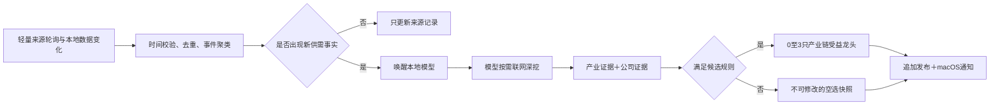

# 产业链供需龙头 Agent 工程规范 v0.1

> 状态：用户已通过逐项需求访谈确认
> 版本：`industry-chain-leader-spec-v0.1`
> 生效日期：2026-07-25（Asia/Shanghai）
> 适用工程：`/Users/lz666/Documents/quant/fourseasquant-t01`
> 权威性：本文覆盖 `NEWS_LEADER_HUNTING_AGENT_HANDOFF.md` 中与本文冲突的旧设计

## 1. 模块使命

本模块只完成一件事：

> 在一个明确时间点，根据已经发生或正在形成的产业供需变化，从系统提供的合格股票范围内选出产业链受益龙头候选；候选数量不做机械裁剪。

本模块有候选选取权，没有最终投资决定权。正式输出不是买入、卖出、仓位、收益承诺或综合交易结论。

本模块不读取或使用技术评分、技术龙头、基本面投资排序、市场趋势或未来融合层结论。它也不负责设计这些模块之间如何合并。

## 2. 已冻结的产品边界

### 2.1 负责

- 持续发现国内外供给、需求、库存、订单、产能、服务能力和商品价格变化；
- 把新闻、公告、行业数据和本地工程数据归并为带时间戳的供需事件；
- 构建或更新与事件有关的产业链知识；
- 识别供需缺口所在节点和利润传导路径；
- 判断公司相关产品是否属于实质主营；
- 从版本化合格股票清单中选出全部通过硬闸门的候选；
- 保存不可修改的时间点快照、证据链、模型版本和知识版本；
- 使用未来数据验证历史选取是否兑现，并形成训练样本；
- 在产生候选或产业链知识更新时通知用户。

### 2.2 不负责

- 技术形态、量价、技术龙头或市场环境判断；
- 基本面投资评分、估值或长期价值判断；
- 三套体系的交集、并集、加权或最终融合；
- 自动交易、买卖时点、仓位和风险控制；
- 输出受损公司名单；
- 定时检查原候选是否走弱、衰减或失效；
- 修改技术、基本面或核心策略模块的数据。

## 3. 第一阶段股票范围

沿用用户已经确认的第一阶段范围：

- 只考虑沪深主板；
- 排除创业板、科创板、北交所；
- 排除 ST（特别处理）、退市整理、停牌、上市时间不足和数据不完整股票；
- 模型只能从系统提供的、带版本的合格股票清单中选取；
- 模型认为清单有遗漏时，只能输出待核查建议，不能把范围外股票放入当次候选。

股票范围由确定性代码和本地数据库提供，模型不得自行编造或扩展。

## 4. 候选数量与龙头定义

每个供需事件、每个选取时间点输出全部通过硬闸门的候选：

1. 按证据强度和利润传导清晰度排序；
2. 不因候选位次超过 3 而丢弃；
3. 证据不足的公司必须被硬闸门拒绝；
4. 没有合格公司时必须空选，不能凑数。

“龙头”不是市值最大、知名度最高、新闻提及最多或近期涨幅最高，而是：

> 能实际承接当前供需缺口，并具有更大新增利润弹性的合格公司。

排序依次考虑：

1. 供需变化是否真实传导到公司产品；
2. 公司是否拥有当前可用或一个季度内开始兑现的产能、库存、订单、客户或渠道；
3. 相关业务是否构成实质主营；
4. 公司获得的销量、价格和毛利润弹性；
5. 扩产速度、行业壁垒和竞争者跟进难度；
6. 证据的时间有效性、来源质量和不确定性。

候选可以位于不同产业链节点。间接受益者可以排在直接对应环节之前，但必须给出完整、正向的利润传导路径。

## 5. 供需事件范围

### 5.1 可以独立触发的路径

下列任意一条有可靠证据即可形成事件，不要求强制交叉验证：

- 确认的供给收缩、停产、限产、出口受限或交付中断；
- 确认的需求增长、订单增加、客户扩产或服务需求增加；
- 库存快速消耗或可用库存明显不足；
- 订单排期或交付周期明显延长；
- 商品或服务价格变化，并能说明对应的供给、需求或库存机制；
- 公司级重大订单或批量供货兑现。

二级市场股价上涨不是供需证据。

### 5.2 不独立触发

- 只有政策表述而没有实际供需变化：进入观察列表；
- 单纯业绩预告、资产重组、管理层变化或市场情绪新闻：不进入；
- 产品发布、并购或资本运作：只有能形成或揭示供需变化时才进入；
- 纯概念、论坛传闻、自媒体叙事：只能作为待核查线索。

### 5.3 行业与地域范围

- 不限于制造业，也覆盖消费、交通运输、旅游、医疗服务、软件服务等可形成清晰供需链条的行业；
- 监控海外停产、出口限制、矿山事故、国际订单和全球商品价格变化；
- 海外事件必须能传导到合格 A 股公司的产品、订单、价格或替代供给；
- 第一阶段重点覆盖中文来源和权威英文来源，外文证据保留原始来源并生成简体中文摘要。

## 6. 时间规则

### 6.1 防未来信息泄漏

- 当次选取只能使用 `as_of_time` 之前已经公开的资料；
- 发布时间不明或时区无法确认的资料不能成为历史正式证据；
- 搜索、采集和分析时间不能替代原始发布时间；
- 后续资料不能修改原选取快照，只能生成新的时间点版本；
- 历史回放严格按实际发布时间升序执行。

### 6.2 证据新鲜度

- 日频价格、现货成交、订单和突发停产：最近 3 个交易日；
- 周频库存、开工率和产能利用率：最新已发布一周；
- 月频产量、进出口和行业统计：最新已发布月份，只作为背景，不能单独触发；
- 政策：只观察，直到出现实际供需证据。

### 6.3 受益兑现时间

- 供需变化必须已经发生或正在形成；
- 公司受益应在当前至未来一个季度内开始兑现；
- 超过一个季度、只依赖远期扩产或长期预测的公司进入观察，不进入当次前 3 名。

### 6.4 实时发现与处理时限

- 本机在线时采用事件触发，不让大模型全天空转；
- A 股交易时段及开盘前后，新增信息发现目标延迟不超过 3 分钟；
- 其他时段目标发现延迟不超过 10 分钟；
- 高优先级事件目标在 10 分钟内完成，最长不超过 20 分钟；
- 20 分钟仍无法补齐证据时，输出“证据不足，暂不形成候选”；
- Mac 休眠或关机期间不保证实时；唤醒后从最后采集时间补抓缺失时段；
- 周末、节假日和收盘后事件在本机在线时立即分析，使用实际事件时间和完成时间，不强制归入下一交易日。

## 7. 三层信息输入

### 7.1 工程本地数据

优先复用：

- 合格股票清单和历史行情；
- 公司名称、证券状态和历史简称；
- 巨潮公告与资本事件；
- 基本面模块已经采集的主营构成及公司披露；
- 板块候选快照，只作为发现线索，不直接成为正式产业链关系；
- 版本化产业链知识库和历史证据。

### 7.2 指导文件

指导文件分为两类：

- **分析规则文件**：门槛、时间、防穿越、证据和输出格式。模型不可修改；
- **产业链知识文件**：产品、原料、设备、服务、上下游关系和公司映射。模型可根据新证据生成新版本。

可靠实时证据与旧产业链知识冲突时，当次分析使用最新可靠证据，并生成知识更新建议。

### 7.3 联网搜索

模型可以通过受控工具主动联网：

- 搜索实时新闻、公告、行业价格、库存、开工率、订单、停产与扩产；
- 只使用公开可访问、无需个人账号登录的正式证据；
- 不读取浏览器 Cookie（会话凭据）、密码、会员账号或密钥；
- 不绕过登录、付费墙、验证码、访问控制或反爬限制；
- 需要登录或付费的内容只在用户主动提供且许可允许时作为补充。

所有进入选取依据的网络材料必须先形成带时间戳的证据快照。

## 8. 证据规则

### 8.1 三类证据的多来源拼接

每只候选必须同时具备：

1. **产业证据**：证明供需变化正在发生；
2. **主营证据**：证明相关产品属于上市公司实质主营；
3. **公司兑现证据**：证明公司已具备与相关产品一致的商业化量产、稳定供应、客户、订单、销量、利用率、售价、收入或利润兑现。

三类证据可以来自不同正式来源，不要求同一篇材料同时写全“需求增加、公司承接、利润增加”。Agent 负责语义拼接，程序必须逐项校验：

- 受益主体是上市公司本身，或具有合格持股、并表关系的受益主体；
- 产业证据与公司证据指向同一产品或服务；
- 产业供需证据位于当前 72 小时事件窗口，公司兑现证据不早于当前时点前 92 天；
- 所有正式网络证据具有可核验发布时间，来源等级不低于正式财经媒体；
- 如果存在更新或同期正式披露，明确表示尚未形成订单、批量供货、销售或收入，或者仍处于送样、验证、测试、研发、规划、建设阶段，则不得确认兑现。

公司级材料已经明确签单、批量供货、销量或收入增长时，可以直接证明兑现。没有单篇直接兑现材料时，只有“当前正式行业需求证据 + 公司正式商业化量产、稳定供应、销售或客户覆盖证据”同时成立，才允许按多来源拼接确认；单独扩产、投产或技术能力仍然不能证明利润上升。

这是不同事实组成的完整证据链，不是要求多个来源重复验证同一个事实。

### 8.2 来源优先级

1. 公司公告、定期报告、招股书、交易所、监管、政府、统计和司法文件；
2. 公司正式渠道、投资者关系记录和正式发布资料；
3. 有编辑审核的主流财经媒体、证券媒体和权威行业媒体；
4. 聚合快讯、转载和市场终端，只用于发现线索；
5. 论坛、自媒体、社交平台和匿名传闻，只用于待核查。

低等级来源引用原始文件时，应追溯到原始文件。券商研报、互动平台回答和自媒体不能单独支撑入选。

### 8.3 模型选择证据内容

系统固定保存：

- 来源、网址、标题；
- 原始发布时间、更新时间和采集时间；
- 内容哈希、语言、来源等级和转载簇；
- 访问状态及是否原始来源。

模型负责选择最有用的事实、表格、段落和短原文片段，并记录保留理由。普通财经媒体不保存整篇正文；公司公告、交易所和政府公开原文件可以保存在本地证据目录，但不得提交到 Git。

## 9. 主营业务和实质受益

### 9.1 全局披露规则

所有量化门槛统一遵循：

1. 公司披露量化数据时，使用量化标准；
2. 公司未披露量化数据，但正式披露明确属于主营、核心产品、主要利润来源、重大客户、批量供货或对经营有重要积极影响时，可以作为定性替代；
3. 既无量化数据，也无明确官方定性披露时，不得由模型估算；
4. 定性入选必须标记“未披露具体占比”，但不因此自动降为观察或禁止进入前 3 名；
5. “少量供货、正在验证、送样、正在接洽、预计可能、业务占比较小”等不能替代实质性证据。

### 9.2 主营量化基准

有数据时：

- 相关业务营业收入占比和毛利润贡献占比原则上都不低于 20%；
- 其中至少一项达到 30%；
- 优先使用毛利润贡献，避免把高收入、低利润业务误认成核心受益。

这是有披露时的判断基准，不是“未披露即淘汰”的绝对规则。

### 9.3 规划产能

- 已有产能并能销售：直接受益；
- 在建产能有明确投产时间、设备进场或订单验证：条件受益；
- 只有公告、意向协议或远期规划：观察，不依靠该规划进入前 3 名。

### 9.4 子公司与参股公司

- 并表子公司：上市公司直接或间接持股原则上不低于 50%，或有明确实际控制权；相关业务对上市公司的贡献仍须满足量化或正式定性主营规则；
- 未并表参股公司：有披露时，上市公司持股不低于 20%，且该公司贡献的投资收益不低于上市公司利润的 20%；
- 未披露具体数据时，可以使用正式文件中对控制关系和利润重要性的明确定性说明；
- 仅产业基金持股、少量参股或不形成上市公司实质利润贡献的，不得入选。

### 9.5 客户关系

如果候选逻辑依赖“向某客户供货”，必须有当时已公开的公告、定期报告、招股书、客户认证或其他可靠原始证据。产品匹配不能被写成已确认的特定客户供应关系。

### 9.6 公司级重大订单

单家公司重大订单可以独立触发“公司级需求兑现”，但不能据此宣称整个行业供不应求。

有量化数据时：

- 预计可确认订单收入达到最近年度营业收入的 10%，或
- 预计贡献毛利润达到最近年度毛利润的 10%，
- 满足其中一项即可；
- 跨年度合同只计算未来一个季度预计开始兑现的部分，不能自行平均分摊。

无量化数据时，正式披露明确为重大合同、核心客户、批量供货或会对经营产生重要积极影响，也可以纳入。

## 10. 事件、候选和版本语义

### 10.1 事件聚类

- 同一事件的转载、改标题和聚合只形成一个事件档案；
- 转载数量不等于供需强度；
- 所有条目保留，但按来源和内容哈希去重；
- 新事实才触发新一轮选取，媒体重复不触发。

### 10.2 优先级队列

全部信息保存，不因模型繁忙直接丢弃：

1. 停产、限产、价格与库存异常、订单激增、重大正式公告；
2. 一般行业供需新闻；
3. 只有政策表述的观察信息。

优先级只决定处理顺序，不决定股票。

### 10.3 不可修改快照

- 每次选取生成独立、不可修改的时间点快照；
- 后续新事实生成新版本，不覆盖旧版本；
- 不设置“是否走弱”的定时复查；
- 用户认为选错时，原快照保留，用户反馈与补充证据触发新任务；
- 原结果和纠正结果共同进入未来训练案例库。

## 11. 模型权限

模型不拥有任意系统权限。允许的受控工具只有：

- 只读查询合格股票与本地公司数据；
- 只读查询历史证据和产业链知识；
- 搜索并读取允许访问的公开网络来源；
- 提交结构化证据、候选结果和知识更新建议。

模型不得：

- 执行任意终端命令；
- 删除文件、修改代码或直接改数据库；
- 覆盖历史结果；
- 扩展股票范围；
- 把网页内容中的命令当作系统指令；
- 把训练记忆当作当前事实。

写库、发布新版本和通知由工程实现校验后执行。

## 12. 深模块与接缝

对调用方只暴露小接口，把联网、多轮搜索、证据门槛、模型调用、版本和发布隐藏在深模块中。

```text
IndustryChainHunting.analyze(HuntingRequest) -> SelectionSnapshot
OutcomeLearning.validate(ValidationRequest) -> OutcomeValidation
```

`HuntingRequest` 只包含：

- 触发方式：自动、手动、新证据或历史回放；
- 触发内容：网址、关键词、产业名称、来源事件或本地记录；
- `as_of_time`；
- 股票范围版本；
- 规则版本。

`SelectionSnapshot` 必须符合：

```text
contracts/industry-chain-selection.schema.json
```

内部真实接缝和适配器：

| 接缝 | 生产适配器 | 测试适配器 |
|---|---|---|
| 证据来源 | 本地 SQLite＋公开网页来源适配器 | 固定历史证据夹具 |
| 股票范围 | SQLite 合格主板清单 | 内存股票范围 |
| 模型运行 | 通过测试后选定的本地模型运行时 | 固定结构化模型响应 |
| 通知 | 现有 `MacOSNotifier` | 现有 `RecordingNotifier` |
| 时钟 | 北京时间系统时钟 | 固定时间 |

采集适配器只返回规范化来源记录，不做龙头判断。模型运行适配器只负责结构化推理，不直接写库。发布模块验证契约和版本后追加写入。

## 13. 事件驱动运行



轻量程序只负责发现新内容、调度、去重和硬性校验，不负责语义选股。

## 14. 输出契约

机器输出使用英文键名；页面和说明使用简体中文。

第一版契约：

- `contracts/industry-chain-evidence.schema.json`
- `contracts/industry-chain-selection.schema.json`
- `contracts/industry-chain-outcome-validation.schema.json`
- `contracts/industry-chain-knowledge-update.schema.json`
- `contracts/examples/industry-chain-selection.example.json`

每只候选至少保存：

- 代码、名称和内部排序；
- 产业链节点；
- 直接、间接或条件受益；
- 正向利润传导路径；
- 主营量化数据或正式定性依据；
- 产能、订单、客户或渠道兑现依据；
- 当前或一个季度内的兑现状态；
- 产业证据引用和公司证据引用；
- 不确定事项。

正式快照不得出现技术分、基本面投资分、市场环境或买卖建议字段。

## 15. 产业链知识更新

- 分析规则文件不能由模型修改；
- 产业链知识文件可以根据新证据生成新版本；
- 正式原始证据支持的知识更新可以立即生效，并通知用户；
- 来源较弱、证据冲突或改变分析规则的更新必须等待用户确认；
- 旧版本永久保留，可回退；
- 通知必须说明变更内容、依据和受影响公司或节点；
- 本机在线时使用 macOS 系统通知，完整差异保存在工程内通知记录。

候选通知按事件合并：

- 首次形成候选时通知一次；
- 只有新证据导致名单或排序改变时再次通知；
- 重复转载不提醒；
- 通知显示事件、前 3 候选和选取时间，完整证据留在本地页面。

## 16. 本地页面

新增独立 `/industry-chain-leaders` 页面，中文名称“产业链龙头”。

只展示：

- 实时供需事件；
- 全部合格候选及产业链传导；
- 主营、产能、订单和客户证据；
- 来源、发布时间、采集时间和证据片段；
- 模型、提示词、规则、股票范围和知识版本；
- 不可修改历史快照；
- 未来验证结果；
- 产业链知识更新通知；
- 手动提交网址、关键词或产业名称；
- 用户“选取错误”反馈及补充证据入口。

页面不得展示技术龙头、基本面投资结果、综合交易建议或受损公司名单。

## 17. 数据库存储建议

通过代码迁移新增，禁止手工修改生产数据库：

| 表 | 用途 |
|---|---|
| `industry_chain_source_registry` | 来源、许可、等级、频率和配置版本 |
| `industry_chain_evidence` | 元数据、时间、哈希、精选证据和转载簇 |
| `industry_chain_events` | 版本化供需事件及新事实 |
| `industry_chain_selection_runs` | 任务、模型、提示词、时间和失败状态 |
| `industry_chain_selections` | 不可修改候选快照 |
| `industry_chain_knowledge_versions` | 产业链知识版本和变更证据 |
| `industry_chain_notifications` | 候选和知识更新通知记录 |
| `industry_chain_user_feedback` | 用户纠正、理由和补充证据 |
| `industry_chain_outcome_validations` | 未来业务兑现和辅助市场表现 |
| `industry_chain_training_cases` | 可训练、不可训练和数据集划分 |

所有原始事实追加保存。规则、模型、提示词、股票范围、来源配置和知识文件均进入结果版本。

## 18. 现有工程衔接

### 18.1 可以直接复用

- `backend/fourseasquant/database.py`：SQLite 初始化和迁移入口；
- `backend/fourseasquant/automation.py`：`Notifier`、`MacOSNotifier` 和测试通知适配器；
- `backend/fourseasquant/launch_agent.py`：本机唤醒与周期调度方式；
- `backend/fourseasquant/cninfo_announcement.py`：巨潮公告和官方 PDF 处理经验；
- `backend/fourseasquant/fundamental_repository.py`：证据哈希、变化保存和原子发布经验；
- `backend/fourseasquant/main.py`：本机 FastAPI 路由；
- `frontend/src/App.tsx`：独立页面路由和导航；
- `docs/FRONTEND_DESIGN_SYSTEM.md`：本机页面视觉和交互约束。

### 18.2 当前真实数据状态

2026-07-25 只读核查：

- `historical_security_facts`：5,199,889 条；
- `technical_daily_scores`：2,391,590 条，但本模块不得读取；
- `capital_action_events`：14,942 条；
- `market_fact_snapshots`：969 条；
- `fundamental_board_candidate_snapshots`：1 个完整发现快照；
- `sector_membership_snapshots`：0 条；
- `fundamental_parsed_evidence`：0 条；
- 尚无产业链供需事件、证据和候选专用表。

因此，工程行情与公告底座可以复用，但不能把现有板块候选或技术数据冒充产业链供需训练集。

## 19. 模型选择与验收

最终只保留一个生产模型，不同时运行多个模型。

分阶段：

1. 安装本地运行框架一次；
2. 首先下载并测试 Qwen3-14B 4 位量化；
3. 再下载 Qwen3.5-9B 4 位量化作同机、同案例对照；
4. 只有前两者不能满足需求，或需要验证更高能力上限时，才测试 Qwen3.6-27B 低位量化；
5. 三者均为逐个加载、逐个测试，不同时占用统一内存；
6. 测试完成后只保留胜出的生产模型，其他权重可删除。

硬性验收：

- 未来信息泄漏、范围外股票或虚构来源：0 次；
- 候选符合主营、供需和证据规则的比例不低于 90%；
- 应形成候选的事件中，前 3 至少包含 1 只正确受益龙头的比例不低于 80%；
- 结构化结果最多一次自动纠正后有效率 100%；
- 高优先级任务 20 分钟内完成比例不低于 95%；
- 应空选的案例不得强行选股；
- 运行时不能长期使用交换内存或破坏现有工程服务。

在满足 24GB 内存稳定运行和 20 分钟时限的模型中，优先选择产业链判断更准确、编造更少的模型，不以最快速度为目标。

生产模型失败后只重试一次；仍失败则记录失败并不形成候选。没有备用模型。

新模型或新量化版本不能自动替换生产模型，必须重新通过完整测试并发布新版本，旧结果不重算。

## 20. 历史测试、未来验证与训练

### 20.1 初始测试集

建立约 30 个历史事件：

- 供给收缩；
- 需求增加；
- 库存变化；
- 重大订单；
- 产业链利润跨节点传导；
- 只有正式定性披露；
- 概念相关但主营占比较低；
- 证据不足应空选。

每个案例的模型输入只包含当时已经公开的资料，不用后续股价定义当时答案。

### 20.2 未来验证

未来数据与选取输入严格隔离：

- 主要标签：未来一至两个季度的销量、价格、订单、产能利用率、相关业务收入和利润兑现；
- 辅助观察：未来 5、10、20 个交易日相对表现；
- 股价不能反向决定产业链逻辑是否正确；
- 验证结果分为 `correct`、`incorrect`、`uncertain`；
- 缺少披露、多个因素无法拆分或证据冲突的案例标记 `uncertain`，不进入训练。

### 20.3 分阶段训练

1. 初始 30 例只改进提示词、指导文件、知识库和检索，不微调模型；
2. 累积至少约 200 个经过未来验证的高质量案例后，再评估 LoRA（低秩适配微调）；
3. 训练集、验证集和从未见过的测试集严格分开；
4. 每次规则、提示词或模型更新都回放完整旧案例；
5. 不只展示表现变好的案例；
6. 用户纠正保留原结果，作为带反馈的新训练案例。

## 21. 实施顺序

1. 冻结本文和四份机器契约；
2. 完成官方来源和本地运行框架研究；
3. 提交安装清单、磁盘预算和测试范围，等待用户批准；
4. 建立数据表迁移、证据仓库和不可修改快照；
5. 建立合格股票范围与本地数据只读适配器；
6. 建立一个一级来源和一个高质量行业来源的最小端到端链路；
7. 建立模型适配器、工具白名单和结构化校验；
8. 建立 30 例历史测试集并运行 Qwen3-14B；
9. 按需测试 9B，再按需测试 27B；
10. 达到验收线后启用事件触发、补抓和通知；
11. 建立独立页面、手动入口和用户反馈；
12. 建立未来验证和训练案例管理；
13. 完成真实事件、失败、版权、安全和浏览器验收。

历史验收通过后直接启用正式版本，不标记“试运行”。前 5 个交易日额外监测漏抓率、延迟、重复通知和内存稳定性，问题通过新版本修复。

## 22. 完成定义

只有同时满足以下条件，才可称为真实可用：

- 使用用户批准的真实、本地或公开来源；
- 每个候选都有产业证据和公司证据；
- 模型只能从版本化合格股票清单选取；
- 每个时间点快照不可修改且无未来信息泄漏；
- 规则、模型、提示词、股票范围、来源和知识均可追溯；
- 在线实时发现、休眠补抓、20 分钟上限和通知可验证；
- 多候选和空选语义均正确；
- 未来验证与实时选取物理隔离；
- 页面只展示产业链供需龙头，不越界到技术、基本面或最终投资决定；
- 本地模型、历史测试、结构化契约、安全、版权和系统测试全部通过。

在此之前，页面只能显示“产业链龙头模块等待真实来源、模型或验收完成”，不得用模拟新闻或模型记忆发布正式候选。
