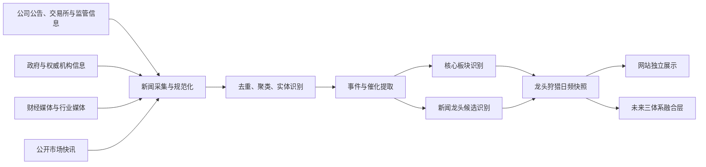

# 龙头狩猎板块 Agent 工程交接

> 用途：把本文交给新的龙头狩猎 Agent 后，它应能直接定位 Fourseasquant 项目，理解第三套新闻证据体系的职责边界、拟建接口、数据安全要求和开发顺序，并在完成需求访谈后开始实现。
>
> 本模块与基本面模块、技术面模块同级。它读取可追溯的财经新闻、监管与公司事件，识别当下的新闻核心板块和新闻龙头候选，但不改写基本面结论、技术评分或用户核心策略。

## 1. 接手后的第一步

新 Agent 必须依次阅读：

1. 本文；
2. 仓库根目录的 [`AGENTS.md`](../AGENTS.md)；
3. 仓库内的 [`Mac开发环境_AGENT交接.md`](../Mac开发环境_AGENT交接.md)；
4. [`FUNDAMENTAL_ENGINEERING_HANDOFF.md`](FUNDAMENTAL_ENGINEERING_HANDOFF.md)；
5. [`TECHNICAL_LEADERSHIP_HANDOFF.md`](TECHNICAL_LEADERSHIP_HANDOFF.md)；
6. [`SECTOR_STRATEGY_AGENT_HANDOFF.md`](SECTOR_STRATEGY_AGENT_HANDOFF.md)；
7. [`FRONTEND_DESIGN_SYSTEM.md`](FRONTEND_DESIGN_SYSTEM.md)。

项目位置与远程仓库：

```text
本机项目：/Users/lz666/Documents/quant/fourseasquant-t01
GitHub：git@github.com:zongeli65-lang/Fourseasquant.git
开发分支：agent/akshare-real-market-data
```

进入项目后先确认环境和工作区：

```zsh
cd /Users/lz666/Documents/quant/fourseasquant-t01
git status --short --branch
git log -5 --oneline
```

工作区可能同时存在其他 Agent 的提交或未跟踪文件。不得删除、覆盖、格式化、暂存或提交不属于本任务的文件。提交时只能暂存龙头狩猎模块明确修改的路径。

## 2. 模块定位

龙头狩猎模块是第三套独立分析体系：

1. 基本面体系回答“公司和板块在经营与产业逻辑上是什么”；
2. 技术面体系回答“价格与成交结构是否体现持续领导力”；
3. 龙头狩猎体系回答“当下新闻和事件正在把市场注意力、政策预期与产业催化集中到哪里”。

本模块的核心输出不是交易指令，而是：

- 新闻核心主题或核心板块；
- 新闻龙头候选；
- 事件催化方向；
- 证据强度、来源独立性和新鲜度；
- 候选的确认、延续、衰减或失效状态；
- 每项结论可回溯的新闻证据。



## 3. 已确定且不可自行改变的规则

以下规则由用户当前要求和既有工程边界共同确定。新 Agent 不得在实现中默默改变：

- 模块名称为“龙头狩猎板块”。
- 主要读取财经新闻、公司事件、政策与产业信息，识别当下新闻龙头和核心板块。
- 新闻体系与基本面、技术面同级，不是技术评分的附加项，也不是基本面评分的舆情修正项。
- 新闻结果必须作为独立指标和独立证据展示，不能直接覆盖另外两套结果。
- 新闻龙头、技术龙头和基本面龙头可以不同。分歧本身是有效信息，不应被强行抹平。
- 最终若需要形成综合龙头，只能由未来独立融合层完成。
- 每条结论必须能够回到具体来源、发布时间和事件，不允许只有无法验证的自然语言判断。
- 相同稿件的转载、聚合和改标题转发不能被计算为多个独立证据。
- 新闻热度不等于事实可信度，提及次数不等于事件重要性。
- 未经确认的市场传闻必须单独标记，不能与公司公告、交易所或监管事实混合。
- 新闻模块不能自行改变基本面模块发布的正式板块成员关系。
- 新闻中出现的新主题或新关联可以作为“待基本面确认的主题线索”，但不能直接写入正式成员快照。
- 模块不得输出自动买入、卖出、仓位或收益承诺。
- 结果只在 Fourseasquant 本机网站内查看，不增加导出和公网发布。
- 原始日频结果永久保留；算法或参数改变必须发布新版本，不能覆盖旧版本。

## 4. 与其他模块的职责边界

| 模块 | 负责 | 不负责 |
|---|---|---|
| 基本面模块 | 公司业务、财报、产业归属、板块成员、基本面证据 | 新闻热度、短期催化、技术走势 |
| 技术面模块 | 价格、成交量、局部极值结构、相对强度、技术龙头 | 新闻解释、产业归属、基本面价值 |
| 核心策略模块 | 用户策略定义的市场趋势与策略结果 | 新闻事件分类、板块成员 |
| 龙头狩猎模块 | 新闻事件、催化、核心主题、新闻龙头候选及证据 | 重写成员关系、技术分、趋势或交易指令 |
| 未来融合层 | 并列比较三套体系并形成用户确认的综合视图 | 回写或篡改单项原始结果 |

### 4.1 新闻板块与正式板块的区别

新闻经常先形成临时主题，例如政策概念、突发事件链条或新产品主题。这种主题未必已经存在于基本面板块体系。

因此输出必须区分：

- `canonical_sector`：已经由基本面模块确认的正式板块；
- `emerging_theme`：新闻模块发现、尚待基本面确认的新主题；
- `unresolved_topic`：当前无法可靠映射的新闻话题。

新闻模块可以提出映射建议，但无权把 `emerging_theme` 或 `unresolved_topic` 直接变成正式板块，也无权把股票直接加入正式板块成员。

### 4.2 新闻龙头与技术龙头的区别

新闻龙头代表公司在当前事件叙事中的中心程度、直接受益程度和证据集中程度；技术龙头代表量价结构中的领导力。

新闻模块不得因为股票涨幅大就认定其新闻龙头，也不得因为新闻提及多就认定其技术龙头。网站应允许用户看到：

- 新闻与技术一致；
- 新闻领先、技术未确认；
- 技术领先、新闻证据不足；
- 基本面归属与新闻临时主题存在分歧。

## 5. 新闻证据优先级

具体来源名单和权重尚未由用户最终确认，但数据模型必须保留来源等级。建议的初始证据层级如下：

| 等级 | 来源类型 | 典型用途 |
|---|---|---|
| 一级 | 公司公告、交易所、监管机构、政府部门、司法与统计机构 | 确认已发生事实、政策和正式披露 |
| 二级 | 公司官方渠道、投资者关系记录、正式发布会资料 | 确认公司表述、产品和经营事件 |
| 三级 | 有编辑审核的主流财经媒体、证券媒体、权威行业媒体 | 补充采访、行业背景和市场影响 |
| 四级 | 财经终端快讯、聚合资讯、转载稿 | 发现线索和追踪传播，不独立作为高置信事实 |
| 五级 | 论坛、自媒体、社交平台与匿名传闻 | 只作为待核验线索，不能单独确认结论 |

来源等级不是最终分数。低等级来源若引用一级原始文件，应尽量追溯到原始文件；无法追溯时必须保留不确定性。

## 6. 采集与处理流水线

建议使用以下分层结构，避免采集逻辑、模型判断和发布逻辑混在一个文件中。

### 6.1 来源适配

每个来源使用独立适配器，负责：

- 按许可范围获取公开内容；
- 保存来源标识、网址、标题、发布时间和采集时间；
- 标明是否为原始来源、转载或聚合；
- 计算内容哈希；
- 返回统一结构，不直接做龙头判断。

### 6.2 规范化与时间校验

统一：

- 北京时间和原始时区；
- 股票代码、公司名称和历史简称；
- 板块名称、主题名称和同义词；
- 来源标识与网址；
- 发布时间、更新时间和采集时间。

历史回放必须使用新闻实际发布时间，不得使用采集时间替代发布时间，也不得让目标日之后发布或修订的信息进入当日结果。

### 6.3 去重与事件聚类

至少识别：

- 完全相同内容；
- 通讯社或媒体稿件的重复转载；
- 同一公告的多站点转发；
- 同一事件的连续更新；
- 不同独立来源对同一事件的分别确认。

聚类后分别记录：

```text
article_count               收录文章数量
independent_source_count    独立来源数量
primary_source_count        原始来源数量
first_published_at          最早发布时间
last_updated_at             最后更新时间
```

任何置信判断都应优先使用独立来源和原始来源数量，而不是文章总数。

### 6.4 实体识别

从文本中识别并链接：

- A 股六位股票代码；
- 公司名称、简称与曾用名；
- 产业、产品、政策和地域；
- 正式板块或新闻临时主题；
- 事件主体、受益方、受损方和仅被顺带提及的对象。

公司实体应与项目现有股票清单对齐。无法唯一匹配时保留为未解析实体，不得猜测代码。

### 6.5 事件提取

新闻条目应先归并为事件，再从事件生成板块和龙头候选。事件至少保留：

```text
event_id
event_type
event_time
title
summary
direction
novelty
materiality
duration_hint
companies
sectors
themes
evidence_refs
uncertainties
```

事件类型可以覆盖政策、产业供需、价格变化、重大合同、产品突破、并购重组、资本运作、业绩预告、监管风险、事故灾害和地缘事件，但最终分类表必须经用户确认并版本化。

### 6.6 核心板块与龙头识别

板块与公司候选至少从不同维度保留独立指标：

- 事件直接性；
- 来源可信度；
- 独立来源确认度；
- 新闻新颖度；
- 事件重大性；
- 持续性或可验证期限；
- 公司与事件的直接受益关系；
- 在事件链中的中心程度；
- 同主题内相对证据优势；
- 反向证据与不确定性；
- 随时间衰减程度。

目前尚未确定这些指标的权重、门槛和总分形式。新 Agent 不得自行把临时权重写成永久产品规则。

## 7. 建议的数据契约

下列契约为新模块的工程起点，字段可在需求访谈后细化，但必须维持可追溯、可版本化和无未来信息泄漏。

### 7.1 新闻来源引用

建议模型名：`NewsEvidenceReference`

```text
evidence_id
source_id
source_name
source_tier
source_type
url
headline
published_at
updated_at
collected_at
content_sha256
is_primary
is_reprint
reprint_cluster_id
language
access_status
```

### 7.2 新闻事件

建议模型名：`NewsEventSnapshot`

```text
event_id
event_version
as_of_time
event_type
event_time
title
summary
direction
novelty
materiality
duration_hint
company_entities
canonical_sectors
emerging_themes
independent_source_count
primary_source_count
evidence_refs
counter_evidence_refs
uncertainties
```

### 7.3 新闻核心板块

建议模型名：`NewsCoreSectorSignal`

```text
signal_date
sector_id
sector_name
mapping_status
signal_status
event_ids
directness
source_quality
corroboration
novelty
materiality
persistence
decay_state
evidence_refs
explanation
```

`mapping_status` 至少区分：

```text
canonical
emerging_theme
unresolved
```

### 7.4 新闻龙头候选

建议模型名：`NewsLeaderCandidate`

```text
signal_date
code
name
sector_id
theme_id
candidate_status
direct_beneficiary
event_centrality
source_quality
corroboration
novelty
materiality
persistence
negative_evidence
event_ids
evidence_refs
explanation
```

`candidate_status` 建议先保留：

```text
watch
corroborated
news_confirmed
decaying
invalidated
```

其中 `news_confirmed` 只能表示“新闻证据体系内确认”，不能写成正式综合龙头。

### 7.5 日频发布快照

建议模型名：`NewsLeaderHuntingDailySnapshot`

```text
algorithm_version
source_config_version
entity_mapping_version
actual_data_date
cutoff_at
published_at
complete
coverage_status
source_failures
core_sectors
emerging_themes
leader_candidates
unresolved_entities
unresolved_topics
```

只接受 `complete=true` 的正式快照。某个重要来源失败时，是否还能标记完整，必须由版本化的来源覆盖规则决定，不能由异常处理代码临时判断。

## 8. 数据库存储建议

当前仓库还没有龙头狩猎专用表。建议通过正式数据库迁移新增：

| 建议表名 | 用途 |
|---|---|
| `news_source_registry` | 来源配置、等级、许可状态和启停版本 |
| `news_evidence_references` | 新闻元数据、时间、网址、哈希和转载簇 |
| `news_event_snapshots` | 版本化事件及结构化证据 |
| `news_entity_links` | 新闻实体到股票、板块和主题的映射 |
| `news_core_sector_signals` | 每日新闻核心板块与独立指标 |
| `news_leader_candidates` | 每日新闻龙头候选、状态和证据 |
| `news_hunting_publications` | 完整日频发布批次、覆盖率和版本 |

数据库要求：

- 原始记录追加保存，不静默覆盖；
- 同一网址、内容哈希和发布时间可去重；
- 来源修订保留修订时间和新版本；
- 结构化结果记录算法版本；
- 新闻结论记录输入证据编号；
- 删除来源或修正规则后，旧结果仍可回放；
- 索引支持按交易日、股票、板块、事件和来源查询；
- 不把完整受版权保护的新闻正文永久写入数据库。

## 9. 版权、访问和安全边界

必须遵守：

- 不绕过登录、付费墙、验证码、访问控制、反爬限制或网站许可；
- 不读取或提交浏览器会话、Cookie（浏览器会话凭据）、密码、访问令牌和其他秘密；
- 不把完整新闻正文、付费研报或长篇受版权保护内容复制进数据库、日志或 Git；
- 优先保存元数据、来源链接、内容哈希、自行生成的短摘要和必要的短证据片段；
- 如采集器需要临时处理正文，应按来源许可设置短期缓存和清理策略；
- 任何大语言模型 API（应用程序接口）密钥只能由用户在本机安全配置，不能写入代码或设置页面；
- 日志只记录任务、来源、阶段、时间、数量和异常类型，不记录正文或凭据；
- 不向外部模型发送未获许可的完整付费内容；
- 所有网页和数据默认只在本机回环地址提供。

## 10. 大语言模型与规则引擎边界

新闻语义提取可以使用规则、传统自然语言处理或大语言模型，但必须保持可复现和可审核：

- 采集、时间校验、去重、来源等级和证券代码映射应由确定性代码完成；
- 大语言模型可以辅助事件归纳、实体候选、关系提取和短摘要；
- 模型输出必须经过结构化数据模型校验；
- 每个结论必须保留输入证据编号；
- 模型名称、版本、提示词版本和运行时间必须记录；
- 温度等随机性参数应固定，失败重试不得产生无法解释的多版本覆盖；
- 模型无法确认时输出不确定，不得补造公司、股票代码、板块或事件；
- 正式发布不能依赖单段自然语言回答；
- 更换模型或提示词必须形成新算法版本并允许历史对比。

是否使用本地模型、外部模型或完全机械化规则，当前尚未确定，应由新 Agent 使用 `$grill-me`（需求追问技能）向用户确认。

## 11. 日频时间与历史回放

Fourseasquant 当前是收盘后日频复盘应用，每个交易日北京时间 16:30 自动更新。龙头狩猎模块第一阶段应与此节奏一致：

- 当日正式快照使用明确的 `cutoff_at`；
- 截止时间之后的新闻进入下一次发布或补充版本，不得反向污染已经回放的当日结果；
- 非交易日新闻如何归属下一交易日，需要版本化日历规则；
- 历史回放严格按新闻原始发布时间升序进行；
- 文章后来更新时，只有当时可见的版本可以进入历史结果；
- 所有日频结果永久保留；
- 日期范围补算必须复用同一生产流水线。

用户尚未确认是否需要盘中实时狩猎。除非用户明确改变产品定位，第一阶段不得自行扩展为高频实时资讯终端。

## 12. 状态机建议

为了避免单篇新闻直接生成“龙头”，建议使用明确状态：

1. `watch`：发现相关线索，但来源、实体或影响尚未充分确认；
2. `corroborated`：已有原始来源或多个独立来源交叉确认；
3. `news_confirmed`：在新闻体系的版本化规则内满足龙头确认条件；
4. `decaying`：没有新催化、事件期限临近或证据影响衰减；
5. `invalidated`：原始事实被否认、公司关系被证伪或出现重大反向证据。

具体确认天数、时间衰减函数、门槛和失效规则尚未由用户确认。实现前必须访谈，不得照搬技术龙头的两日确认和分差规则。

## 13. 每日任务与失败回退

龙头狩猎应接入现有每日任务，而不是建立互相独立的发布系统。

现有入口：

```text
backend/fourseasquant/daily_snapshots.py
backend/fourseasquant/candle_daily_task.py
backend/fourseasquant/automation.py
```

建议在现有阶段语义中细分本模块内部步骤：

```text
source_collection
normalization
deduplication
entity_resolution
event_extraction
signal_generation
output_validation
transactional_publish
```

必须保持：

- 任何必需来源或校验失败时，不发布残缺快照；
- 残缺新闻数据绝不能覆盖最近一次完整成功结果；
- 网站顶部显示醒目的“今日更新失败”、失败阶段和时间；
- 页面继续展示最近一次成功结果并明确其实际数据日期；
- “重新运行今日任务”复用同一生产流水线；
- 成功和失败都发送本机通知；
- 简洁任务历史在网站内查看，完整日志保存在本机；
- 新闻失败不得阻止技术面和基本面旧结果继续可见；
- 是否允许三体系分别成功发布，需要由未来总编排契约明确，不能隐式混用半成品。

## 14. 网站展示要求

建议在现有多页面工作台中增加独立“龙头狩猎”页面，不挤入单一总览页面。

页面优先级：

1. 新闻核心板块排行榜；
2. 新闻龙头候选排行榜；
3. 主题与公司关系热力图；
4. 事件时间线；
5. 候选详情和证据抽屉；
6. 与基本面、技术面结果的并列对照。

每个结果至少显示：

- 实际数据日期和新闻截止时间；
- 新闻体系状态；
- 来源等级与独立来源数量；
- 主要事件和催化方向；
- 新闻龙头候选状态；
- 支持证据、反向证据和不确定性；
- 原始来源链接；
- 算法与来源配置版本；
- 是否为正式板块、临时主题或未解析话题。

界面必须遵守：

- Swiss Modernism 2.0（瑞士现代主义 2.0）明亮米黄色设计系统；
- 仅优化桌面浏览器；
- 加载、空数据、来源不全、失败和成功都有明确文字；
- 不用颜色单独表达可信度；
- 不使用耸动标题、倒计时或营销式动画；
- 不把新闻热度渲染成确定性上涨信号；
- A 股红涨绿跌只用于行情语义；
- 点击股票进入 `/quotes` 并保留目标日期；
- 页面运行时不依赖外部字体、图标或分析脚本。

## 15. 当前代码状态与可复用能力

截至本文创建时，仓库没有龙头狩猎专用实现、数据库表、接口或页面。

可以复用：

| 现有能力 | 路径或说明 |
|---|---|
| 本机 SQLite（本地数据库）和迁移入口 | `backend/fourseasquant/database.py` |
| 每日任务、事务发布和失败回退 | `backend/fourseasquant/daily_snapshots.py` |
| 16:30 自动化和通知 | `backend/fourseasquant/automation.py` |
| A 股股票与指数历史数据 | 现有 AKShare 行情链路 |
| 板块成员正式契约 | `backend/fourseasquant/sector_leadership.py` |
| 基本面板块候选发现 | `backend/fourseasquant/fundamental_discovery.py` |
| 讨论热度的机械聚合经验 | `backend/fourseasquant/discussion_sentiment.py` |
| 真实日 K 股票跳转 | `/quotes` 页面 |
| 前端品牌与状态规范 | `docs/FRONTEND_DESIGN_SYSTEM.md` |

不得把已有“讨论情绪”直接改名为龙头狩猎。讨论情绪只是潜在线索之一，不具备权威新闻来源、事件聚类、原始证据追踪和新闻龙头确认能力。

## 16. 新 Agent 应向用户确认的问题

用户会要求新 Agent 使用 `$grill-me`。不要重复询问本文已经确定的模块边界，优先确认会实质改变数据和算法的少量问题：

1. 第一阶段允许使用哪些新闻、公告和财经来源，是否全部要求无需登录；
2. 日频 16:30 是否为唯一正式发布时间，还是未来还要盘中增量更新；
3. “核心板块”和“新闻龙头”各自满足什么条件才能从观察升级为确认；
4. 是否允许使用大语言模型；若允许，使用本地模型还是用户配置的外部模型；
5. 首次历史初始化需要回补多长时间，以及可接受的来源覆盖缺口；
6. 网站是只展示新闻体系，还是第一阶段就并列显示基本面与技术面分歧。

不要在第一次访谈中追问所有字段和数据库细节。具体实施方案由 Agent 根据确认后的产品规则设计，再向用户汇报关键取舍。

## 17. 推荐实施顺序

1. 完成需求访谈并冻结第一版来源范围、截止时间和确认规则；
2. 建立来源注册表、允许访问策略和统一证据模型；
3. 先接一个一级来源和一个高质量财经媒体，验证完整流水线；
4. 实现北京时间、发布时间和历史防穿越校验；
5. 实现内容哈希、转载簇和独立来源去重；
6. 建立 A 股公司实体解析与不确定实体隔离；
7. 建立事件快照、核心主题信号和龙头候选契约；
8. 建立确定性指标与可审核的模型辅助层；
9. 增加数据库迁移、持久化、版本和回放；
10. 接入每日任务的暂存、校验和原子发布；
11. 提供只读接口、日频回退和来源状态；
12. 实现龙头狩猎页面、排行榜、热力图和证据详情；
13. 接入日期范围补算、16:30 自动运行和通知；
14. 使用真实新闻完成系统测试、版权检查和桌面浏览器验收；
15. 更新契约、运维说明和本交接文档。

## 18. 建议代码结构

以下文件目前不存在，只是建议边界；新 Agent 可以在设计评审后调整命名：

```text
backend/fourseasquant/news_sources.py
backend/fourseasquant/news_normalization.py
backend/fourseasquant/news_deduplication.py
backend/fourseasquant/news_entities.py
backend/fourseasquant/news_events.py
backend/fourseasquant/news_leader_hunting.py
backend/fourseasquant/news_repository.py
backend/fourseasquant/news_daily_task.py

scripts/import_news_history.py
scripts/run_news_leader_hunting.py

contracts/news-evidence.schema.json
contracts/news-event.schema.json
contracts/news-leader-hunting.schema.json
contracts/examples/news-leader-hunting.example.json

frontend/src/NewsLeaderHuntingPage.tsx

tests/test_news_sources.py
tests/test_news_deduplication.py
tests/test_news_entities.py
tests/test_news_events.py
tests/test_news_leader_hunting.py
tests/test_news_api.py
```

不要建立一个同时完成下载、调用模型、评分、写库和生成页面数据的巨型文件。采集适配器、确定性证据处理、语义提取、领域判断和发布必须能够独立测试。

## 19. 验收标准

### 19.1 数据和时间

- 不晚于目标截止时间的新闻才能进入当日结果；
- 发布时间缺失或时区不确定的新闻不能进入正式历史回放；
- 同源转载不会增加独立来源数量；
- 同一事件的更新保留版本关系；
- 股票代码和公司名称无法唯一匹配时不会猜测；
- 重要来源失败会反映在覆盖状态；
- 不完整批次不会覆盖上一完整批次。

### 19.2 新闻判断

- 单篇低等级来源不能直接确认新闻龙头；
- 公司被顺带提及不会被当成直接受益方；
- 事件存在反向证据时会显式展示；
- 新闻临时主题不会自动改变正式板块成员；
- 新闻、技术和基本面分歧能够并列保存；
- 每个核心板块和龙头候选都能追溯到证据编号；
- 更换规则、模型或提示词会产生新版本。

### 19.3 版权和安全

- 数据库和 Git 不保存完整付费新闻正文；
- 采集器不绕过登录、验证码或付费墙；
- 日志不包含正文、浏览器会话或密钥；
- 外部模型调用只发送获许可的最小必要内容；
- 网站和接口只在本机运行。

### 19.4 页面

- 新闻核心板块和龙头候选使用真实接口；
- 来源不全、无结果、失败和陈旧结果都有明确状态；
- 排行、热力图、时间线和证据详情在桌面端可用；
- 点击股票可以进入对应日 K 页面；
- 页面明确区分新闻确认、技术确认和基本面归属；
- 1440 像素及以上无整页横向滚动；
- 浏览器控制台没有新增错误。

完整交付前至少运行：

```zsh
npm run typecheck
npm test
```

## 20. 本机运行与 Git 安全

环境准备：

```zsh
cd /Users/lz666/Documents/quant/fourseasquant-t01
uv sync
npm install
```

开发运行：

```zsh
npm run dev
```

生产式本机预览：

```zsh
npm start
```

Git 提交前：

```zsh
git status --short
git diff --check
git diff --cached --check
```

只提交本任务文件。不得执行会删除其他 Agent 工作的 `git reset --hard`、`git checkout --` 或宽泛清理命令。

## 21. 完成交接的定义

龙头狩猎模块只有同时满足以下条件，才可以称为真实可用：

- 使用用户批准的真实新闻与正式信息来源；
- 新闻时间、来源、转载和实体映射可验证；
- 每个核心板块和龙头候选都有可追溯证据；
- 算法、模型、提示词、来源配置和实体映射均带版本；
- 历史回放不存在未来信息泄漏；
- 新闻结果与基本面、技术面同级且互不污染；
- 每日 16:30 可以自动运行并原子发布；
- 失败时保留上一完整结果并提供网站重试；
- 网站可以查看排行榜、热力图、事件和证据；
- 全部日频发布结果永久保留；
- 版权、安全、自动测试和桌面浏览器验收通过。

在此之前，网站只能显示“龙头狩猎模块等待真实来源或规则确认”，不得使用模拟新闻、测试事件或大语言模型臆测作为正式市场结论。
