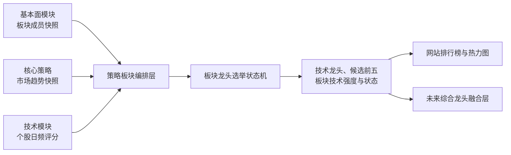

# 策略板块 Agent 工程交接

> 用途：把本文交给新的策略板块 Agent 后，它应能直接定位 Fourseasquant 项目，理解模块边界、现有接口和未完成工作，并在完成需求访谈后开始开发。
>
> 本文描述的是“策略输入驱动的板块技术龙头与板块强度模块”，不是基本面板块归属模块，也不是个股技术评分模块。

## 1. 接手后的第一步

新 Agent 必须先阅读：

1. 本文；
2. 仓库根目录的 [`AGENTS.md`](../AGENTS.md)；
3. 仓库内的 [`Mac开发环境_AGENT交接.md`](../Mac开发环境_AGENT交接.md)；
4. [`TECHNICAL_LEADERSHIP_HANDOFF.md`](TECHNICAL_LEADERSHIP_HANDOFF.md)；
5. [`FUNDAMENTAL_ENGINEERING_HANDOFF.md`](FUNDAMENTAL_ENGINEERING_HANDOFF.md)；
6. [`FRONTEND_DESIGN_SYSTEM.md`](FRONTEND_DESIGN_SYSTEM.md)。

项目位置与远程仓库：

```text
本机项目：/Users/lz666/Documents/quant/fourseasquant-t01
GitHub：git@github.com:zongeli65-lang/Fourseasquant.git
当前开发分支：agent/akshare-real-market-data
```

进入项目：

```zsh
cd /Users/lz666/Documents/quant/fourseasquant-t01
git status --short --branch
```

工作区可能同时存在其他 Agent 的未提交修改。不得删除、覆盖、格式化、暂存或提交不属于本任务的文件。开始开发前先查看 `git status`，提交时只暂存本 Agent 明确修改的路径。

## 2. 模块目标

本模块接收三类已经确认的数据：

1. 基本面模块发布的板块成员关系；
2. 核心策略发布的市场趋势；
3. 技术模块发布的全市场个股日频技术评分。

本模块据此执行可重放、可解释、带版本的板块技术龙头选举，并以确认后的技术龙头表现代表板块技术强弱。输出用于网站的板块排行榜和热力图，也为未来的技术与基本面融合层保留稳定接口。



## 3. 不可越界的产品规则

以下规则已经由用户确认。新 Agent 不得自行更改；如确需调整，只能先通过 `$grill-me`（需求追问技能）与用户确认，并通过后端新算法版本发布。

- 板块成员关系由基本面分析决定，主要依据财报、公司与行业研究、财经软件简报和快报；策略板块模块不得自行认定成员。
- 不直接导入第三方软件的板块涨跌幅或板块指数作为最终强弱结论。
- 市场趋势由用户的核心策略提供。本模块只消费趋势，不推测、不替代、不重写趋势。
- 一个板块只由确认后的真正技术龙头代表技术强弱，不使用全体成员简单平均代替龙头。
- 宁可牺牲早期识别速度，也要降低把短期冲高股票误判为真正龙头的概率。
- 技术评分与基本面评分是两个独立体系。本模块不得根据新闻、研报或财务叙事修改技术分。
- 技术龙头候选范围包括沪深主板、创业板和科创板，但必须先属于基本面模块发布的有效板块成员。
- 股票走势按函数结构理解：经平滑后的一阶导数接近零处形成局部极值；局部高点不断抬高，回调形成的局部低点也不断抬高。抬升差值越大，结构得分越高。
- 相对表现使用 3、5、10 个交易日，不使用 20 日作为核心窗口。
- 同一股票可以同时成为多个板块的技术龙头；汇总市场暴露时按股票代码去重。
- 前端只读，不允许人工指定龙头或修改评分参数。参数只能在后端调整，并必须生成新版本。
- 不生成综合市场判断。板块强度、趋势环境、候选状态等指标应独立展示。

## 4. 四个模块的职责边界

| 模块 | 负责 | 不负责 |
|---|---|---|
| 基本面板块模块 | 板块定义、成员归属、生效区间、变更原因、证据 | 技术评分、市场趋势、技术龙头 |
| 个股技术评分模块 | 每只股票的 0—100 日频技术分、结构证据、突破和相对强度 | 板块归属、基本面判断、最终板块强弱 |
| 核心策略模块 | 每个交易日的市场趋势状态、趋势编号、趋势是否切换 | 板块成员和技术评分 |
| 策略板块模块 | 输入适配、历史回放、龙头选举、板块技术强度、发布与查询 | 擅自修改上述三个上游结论 |

### 4.1 舆论调查目标接口

核心策略是自动舆论调查的唯一目标发布者。策略每天可发布零至十只有序股票
代码；顺序就是调查优先级。发布接口只包含：

```text
actual_date       策略目标日期
strategy_version  产生目标的策略版本
codes             零至十只、不可重复、保持优先级顺序的六位股票代码
published_at      带时区的发布时间
```

同日同策略版本不可覆盖；目标变化必须发布新策略版本。舆论模块没有收到当天
完整快照时不得创建自动任务，也不得用热榜、重点监测、技术排行或产业链候选
补位。当前策略页面仍是演示策略，真实生产者尚未接入。

仓库内进程调用 `publish_strategy_opinion_targets(...)`；验证适配器可调用
`PUT /api/public-opinion/strategy-targets`。

未来若增加综合龙头，必须另建融合层。融合层可以同时消费技术结果和基本面评分，但不得回写或污染两个原始体系。

## 5. 已实现的技术底座

### 5.1 个股技术评分

主要代码：[`backend/fourseasquant/technical_scoring.py`](../backend/fourseasquant/technical_scoring.py)

当前算法版本为 `technical-v2`，使用前复权日线计算：

- 3 日 EMA（指数移动平均）；
- 10 日 ATR（平均真实波幅）自适应导数零区间；
- 局部高点和回调低点的抬升结构；
- 进行中突破；
- 3、5、10 日相对强度；
- 成交确认。

当 EMA3 跌破最近确认局部低点 2% 时，原上升结构立即硬失效，结构分和
突破分归零。旧极值不会在反弹后自动复活，股票必须重新形成完整抬升结构。

初始权重为：结构 55、突破 20、相对强度 15、成交确认 10。默认技术龙头合格门槛为 65 分。

最近一年正式结果与正式起点前 60 个交易日预热数据的初始化入口：

```zsh
npm run data:technical-init
```

### 5.2 板块选举状态机

主要代码：[`backend/fourseasquant/sector_leadership.py`](../backend/fourseasquant/sector_leadership.py)

已经实现：

- 完整板块成员快照校验与持久化；
- 按日期读取不晚于目标日的最新成员快照；
- 市场趋势输入模型；
- 按板块生成技术候选前五；
- 最少 3 只有效成员；
- 结构不完整的突破只进入观察名单；
- 新龙头连续 2 日确认；
- 挑战者领先 3 分并连续确认后替换；
- 挑战者单日领先 10 分且成员资格稳定时直接替换；
- 趋势切换、成员移除、技术数据缺失或结构破坏时硬失效；
- 顺势、逆势、震荡环境标记；
- 结果按算法版本、成员版本、日期和板块永久保存；
- 同样输入得到同样结果的确定性历史回放。

当前选举状态：

| 状态值 | 含义 |
|---|---|
| `insufficient_samples` | 有效成员少于最低数量 |
| `no_qualified_candidate` | 没有结构和分数均合格的候选 |
| `pending_confirmation` | 候选仍在完成确认期 |
| `confirmed` | 已有确认技术龙头 |
| `hard_invalidated` | 原龙头触发硬失效 |

### 5.3 已有数据库表

数据库默认位于：

```text
data/fourseasquant.db
```

相关表：

| 表 | 用途 |
|---|---|
| `technical_daily_scores` | 永久保存个股日频技术分及证据 |
| `technical_score_publications` | 保存完整技术评分批次的版本和正式日期范围 |
| `sector_membership_snapshots` | 保存完整、版本化的板块成员快照与内容哈希 |
| `sector_leader_election_results` | 保存每个算法版本、成员版本、日期和板块的选举结果 |

数据库建表入口在 [`backend/fourseasquant/database.py`](../backend/fourseasquant/database.py)，不得直接手工改生产数据库结构；应通过代码迁移和测试完成。

## 6. 上游输入契约

机器接口字段统一使用英文，用户界面和文档使用简体中文。

### 6.1 板块成员快照

模型：`SectorMembershipSnapshot`

关键字段：

```text
membership_version   成员关系版本
fundamental_version  基本面规则或模型版本
effective_date       快照生效日期
published_at         发布时间，必须带时区
complete             是否完整；只接受 true
memberships          全量成员关系
```

每条成员关系至少包含：

```text
sector_id
sector_name
code
effective_from
effective_to
is_active
change_reason
evidence_refs
```

规范与示例：

```text
contracts/sector-membership.schema.json
contracts/examples/sector-membership.example.json
```

本机服务目前只公开了读取规范的接口：

```http
GET /api/contracts/sector-membership
```

重要限制：

- `complete=false` 会被模型直接拒绝；
- 不允许同一板块、股票和生效日期出现重复关系；
- 当天基本面更新失败时，应继续使用最近一次完整快照并标记 `membership_stale=true`；
- 从未收到完整快照时，不得生成真实板块龙头或用模拟成员补位；
- 基本面模块当前的发现数据不等于正式 `SectorMembershipSnapshot`，两者之间尚缺生产级发布适配器。

### 6.2 核心策略趋势快照

模型：`MarketTrendSnapshot`

```text
actual_data_date   实际交易日期
trend_id           一段连续趋势的唯一编号
trend_state        rising / falling / sideways
trend_changed      当天是否发生趋势切换
trend_start_date   本轮趋势起始日期
strategy_version   产生趋势的策略版本
```

其中：

- `rising` 表示上升趋势；
- `falling` 表示下降趋势；
- `sideways` 表示震荡趋势。

`market-environment-v1` 已提供正式机械趋势快照、历史存储与查询接口。板块选举后续应通过适配器读取其 `trend_id`、`trend_state`、`trend_start_date` 和 `rules_version`，不得另写一套临时趋势规则。

### 6.3 个股技术评分

模型：`TechnicalScoreView`

选举层至少依赖：

```text
version
actual_data_date
code
name
board
structure_state
structure_valid
active_breakout
structure_score
breakout_score
relative_strength_score
turnover_score
total_score
```

只允许使用目标日及以前的数据。股票在成员快照中有效但当天没有有效技术分时，不得虚构分数；应降低 `valid_member_count`，并按最低样本规则处理。

## 7. 下游输出契约

完整规范：

```text
contracts/sector-leadership.schema.json
```

导出或刷新两个 JSON Schema（JSON 数据结构规范）：

```zsh
uv run python scripts/export_leadership_contracts.py
```

单个板块结果的核心字段：

```text
actual_data_date
sector_id
sector_name
membership_version
membership_effective_date
membership_stale
trend_id
trend_state
status
leader_code
leader_name
technical_strength
leader_context
pending_code
pending_days
valid_member_count
candidates
explanation
```

`technical_strength` 目前等于已确认技术龙头的 `total_score`。没有确认龙头时必须为 `null`，不得用候选第一名冒充正式强度。

`leader_context` 只描述龙头所处的策略趋势环境：

- `with_trend`：顺势；
- `counter_trend`：逆势；
- `sideways`：震荡。

它不是新的总判断或交易信号。

## 8. 每日任务与失败语义

项目现有每日任务按以下四个阶段执行：

1. `market_prepare`：市场准备；
2. `strategy_run`：策略运行；
3. `output_validation`：输出校验；
4. `transactional_publish`：事务发布。

入口位于：

```text
backend/fourseasquant/daily_snapshots.py
backend/fourseasquant/candle_daily_task.py
```

当前每日任务会刷新 K 线并暂存技术评分，但还没有把正式成员快照、真实趋势快照和板块选举纳入同一流水线。策略板块 Agent 应将这部分接入现有阶段语义，不另造一套互相冲突的任务系统。

必须保持以下原子发布规则：

- 先在暂存结果中完成成员、趋势、技术分、日期和输出结构校验；
- 全部成功后才发布当天板块结果；
- 任一阶段失败都不得用残缺板块结果覆盖上一版完整成功结果；
- 网站继续显示最近一次成功结果，并在顶部显示醒目的“今日更新失败”、失败阶段和时间；
- “重新运行今日任务”必须复用同一生产流水线；
- 成功和失败都保留简洁任务历史，完整日志保存在本机；
- 每个交易日结果永久保留，补算只能追加或按明确版本重算，不能破坏旧版本。

日常自动运行时间为北京时间 16:30。自动化、通知和日期范围补算已有基础能力，策略板块接入后必须复用，不得要求另开一个常驻调度器。

## 9. 历史初始化和回放

正式上线板块结果前，至少需要：

1. 最近一年及 60 个交易日预热区间的完整个股技术分；
2. 覆盖相同日期的、带生效区间的板块成员历史；
3. 覆盖相同交易日的核心策略趋势历史；
4. 使用同一算法版本按交易日升序重放选举状态机。

不得只拿目标日横截面单独选第一名，因为两日确认、成员稳定期、趋势切换和原龙头保位都依赖历史状态。

历史补算应支持选择日期范围，并记录：

```text
algorithm_version
membership_version
strategy_version
technical_score_version
actual_data_date
published_at
```

现有表还没有把 `strategy_version` 和 `technical_score_version` 提升为独立索引字段。新 Agent 在设计查询和重算策略时应先评估是否需要安全迁移，不得默默覆盖同键的旧语义结果。

## 10. 网站展示要求

产品为仅在本机运行、仅优化桌面浏览器的 Fourseasquant 工作台。视觉规范为 Swiss Modernism 2.0（瑞士现代主义 2.0）的明亮米黄色专业数据界面。

板块页面或模块应遵循：

- 排行榜为主，热力图为辅；
- 默认尝试打开今天；非交易日或今天尚无成功结果时显示上一交易日的完整结果，并明确实际数据日期；
- 板块强度、趋势状态、成员快照状态和龙头确认状态分别展示，不合成一个主观总分；
- 排行只对已有确认龙头的板块使用 `technical_strength`，待确认、样本不足和硬失效必须有明确文字状态；
- 可以展开查看候选前五、分项技术分、确认天数和解释；
- 点击龙头或候选股票应进入 `/quotes`，保留代码和目标日期；
- A 股行情仍采用红涨绿跌，品牌青绿色不得代替涨跌颜色；
- 没有真实完整输入时显示空状态，不生成模拟板块排行；
- 页面运行时不得依赖外部字体、图标、分析脚本或内容分发网络。

现有前端只有个股技术评分面板：

```text
frontend/src/TechnicalLeadershipPanel.tsx
```

现有市场页的板块与概念展示仍来自行情标签，不等同于本模块的正式技术龙头结果。新 Agent 必须在命名、接口和界面上明确区分。

## 11. 当前缺口

以下工作尚未完成，属于下一阶段的真实开发范围：

1. 基本面模块到正式 `SectorMembershipSnapshot` 的生产发布适配器尚未完成；
2. 尚无把三类输入组装成 `ElectionDay` 的生产编排服务；
3. 每日 16:30 流水线尚未运行和原子发布板块选举；
4. 尚无板块结果的生产查询接口；
5. 尚无日期范围板块回放入口；
6. 网站尚无真实板块技术龙头排行榜、热力图和候选详情；
7. 尚未用真实成员历史和真实市场环境完成全量板块选举验收。

## 12. 新 Agent 开发前应向用户确认

用户会要求新 Agent 使用 `$grill-me`（需求追问技能）。不要重新追问本文已经确定的产品规则，也不要陷入实现细节的冗长访谈。优先只确认当前无法从仓库获得的上游事实：

1. 核心策略代码文件或可调用入口在哪里；
2. 策略每天如何输出上升、下降、震荡以及趋势切换；
3. 是否已有可回放的历史趋势结果；
4. 第一阶段希望先完成后端真实流水线，还是后端与板块页面一起交付。

如果策略代码尚未提供，应先完成明确的适配器接口、存储、校验、测试和接线位置，但不得用自创趋势规则伪造正式结果。

## 13. 推荐实施顺序

1. 冻结并测试 `MarketTrendSnapshot` 的发布、存储和读取契约；
2. 完成基本面成员发布结果到 `SectorMembershipSnapshot` 的适配；
3. 建立按目标日期读取三类输入的单一编排入口；
4. 使用真实历史按日期升序执行 `elect_sector_leaders`；
5. 将板块结果与每日快照一起暂存、校验和原子发布；
6. 增加只读查询接口、日期回退和版本信息；
7. 实现排行榜、热力图、候选详情和空数据状态；
8. 接入日期范围补算、16:30 自动任务、成功与失败通知；
9. 使用真实数据进行系统测试和浏览器验收；
10. 更新本文、接口规范和用户可读说明。

## 14. 验收标准

后端至少覆盖：

- 不完整成员快照被拒绝；
- 成员和趋势日期不越过目标日；
- 趋势切换后候选重新完成确认；
- 新成员不能绕过稳定期；
- 不完整结构只能观察；
- 有效成员少于 3 只时不选龙头；
- 硬失效不会保留无效龙头；
- 相同输入和版本的回放结果完全一致；
- 失败不会覆盖最近完整成功结果；
- 补算不会删除旧版本和人工笔记。

前端至少覆盖：

- 排行榜、热力图和候选详情读取真实接口；
- 无真实输入时不出现模拟结果；
- 非交易日和失败日显示上一完整交易日及明确日期；
- 失败横幅、阶段、时间和重新运行入口完整；
- 1440 像素及以上桌面无整页横向滚动；
- 点击股票能够进入对应日 K 页面；
- 浏览器控制台没有新增错误。

现有相关测试：

```zsh
uv run pytest -q tests/test_sector_leadership.py
uv run pytest -q tests/test_technical_score_api.py
```

完整交付前运行：

```zsh
npm run typecheck
npm test
```

## 15. 本机运行与安全规则

安装依赖与启动开发服务：

```zsh
cd /Users/lz666/Documents/quant/fourseasquant-t01
uv sync
npm install
npm run dev
```

正式本机预览：

```zsh
npm start
```

项目只绑定本机回环地址，不应因本模块增加公网部署、远程数据库或云端日志。

禁止事项：

- 不读取、输出、记录或提交密码、GitHub 凭据、访问令牌和其他秘密；
- 本项目正式行情只使用 AKShare（A 股数据接口库），不要引入 Tushare，也不需要 Tushare Token（Tushare 访问令牌）；
- 不向 macOS 系统 Python 安装依赖；
- 不提交数据库、运行日志、缓存或用户本机秘密；
- 不使用残缺数据、模拟成员或自创趋势覆盖正式结果；
- 不借视觉修改改变接口、算法和数据语义。

## 16. 完成交接的定义

策略板块模块只有在以下条件同时满足时，才可称为真实可用：

- 基本面成员、核心策略趋势和技术分均来自版本化真实输入；
- 最近一年历史可以确定性重放；
- 每日 16:30 自动任务可以原子发布；
- 失败时保留上一完整结果并可在网站重新运行；
- 网站展示真实排行榜、热力图、候选证据和实际数据日期；
- 全部日频结果永久保留；
- 参数只能从后端以新版本调整；
- 自动测试和桌面浏览器验收通过。

在此之前，界面必须明确显示“等待完整成员关系或策略趋势”，不得把测试夹具或模拟结果标记为正式板块结论。
