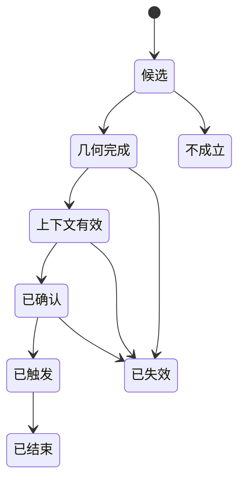

# 交易体系技术形态与摆动背离：数据化规范 v0.1

> 上游主框架：洞察环境 → 主流题材 → 核心龙头 → 趋势确认 → 强势分歧买入
> 知识来源：《日本蜡烛图技术》第四、第五、第六、第七、第八、第九、第十、第十一、第十四、第十五章
> 图例核对：已检查上述章节共 203 幅形态示意图和历史行情图，并结合图片前后说明归纳规则
> 文档日期：2026-07-24
> 当前状态：可编码规则草案；参数为首轮回测初值，不是已经验证有效的实盘参数

## 一、数据化的目标

数据化不是把“锤子线”“启明星”写成一个真假值，而是把一个技术信号拆成可追踪的完整过程：


每个信号必须回答：

1. 形态在什么时间完成；
2. 完成时能看到哪些数据；
3. 前面是否存在可被反转或延续的趋势；
4. 形态是否位于支撑、阻力、窗口或趋势线附近；
5. 后续确认发生在什么时间和价格；
6. 在什么条件下允许交易；
7. 什么价格说明判断错误；
8. 形态最终成功、失败还是只进入横盘；
9. 是否存在未来数据泄漏。

## 二、从书中图例得到的数据化原则

图例检查范围：

| 章节 | 图像数量 |
|---|---:|
| 第四章 反转形态 | 29 |
| 第五章 星线 | 27 |
| 第六章 其他反转形态 | 43 |
| 第七章 持续形态 | 35 |
| 第八章 十字线 | 16 |
| 第九章 技术汇总 | 3 |
| 第十章 信号汇聚 | 8 |
| 第十一章 趋势线 | 26 |
| 第十四章 摆动指数 | 9 |
| 第十五章 成交量、持仓量 | 7 |
| 合计 | 203 |

### 1. 标准形态和变体必须分开

图例中存在大量“不完全标准但仍然有效”的形态，例如：

- 下影线不足实体两倍的锤子线或上吊线；
- 第三根阳线没有充分进入第一根阴线的启明星变体；
- 股票市场中没有理想缺口的流星线；
- 第二次低点略微跌破第一次低点，但卖方无法继续扩大战果。

因此不能只保留一个真假字段。至少要区分：

- 严格形态：满足书中明确几何条件；
- 宽松变体：保留核心多空逻辑，但一个或多个次要条件不足；
- 不成立：核心条件缺失；
- 已确认：宽松或严格形态得到独立证据支持。

### 2. 标准形态也会失败

图例中有外形标准的锤子线未能形成底部，原因包括：

- 前一根是强烈长阴线，下降动能尚未衰竭；
- 锤子线同时跌破重要支撑；
- 后续没有出现阳线或向上突破确认；
- 形态发生后继续放量下跌。

所以必须把“几何质量”和“交易可信度”分开保存。

### 3. 同形异义必须由位置和趋势决定

长下影小实体：

- 下降后是锤子线候选；
- 上涨后是上吊线候选；
- 横盘中可能什么也不是。

长上影小实体：

- 上涨后是流星线候选；
- 下降后是倒锤子线候选；
- 没有前置趋势时只是一根长上影蜡烛线。

### 4. 图例中的确认具有时间顺序

书中常见顺序是：

1. 价格先形成新高或新低；
2. 蜡烛图给出警告；
3. 摆动指标形成背离；
4. 后续蜡烛线突破确认；
5. 才能形成完整交易信号。

代码不能用第四步以后的数据，把信号时间倒填到第一步。

### 5. 汇聚必须来自不同证据域

图例中的强信号通常来自不同来源：

- 价格形态；
- 支撑或阻力；
- 趋势方向；
- 成交量；
- 相对强弱、随机或动力指标；
- 后续突破。

同一根蜡烛线同时被识别为流星线和镊子顶的一部分，不应直接算作两个完全独立的证据。

## 三、行情数据和预处理要求

### 1. 最低数据字段

每个交易周期至少需要：

| 字段 | 含义 |
|---|---|
| 时间 | 交易日或盘中周期结束时间 |
| 开盘价 | 本周期第一笔有效成交价 |
| 最高价 | 本周期最高有效成交价 |
| 最低价 | 本周期最低有效成交价 |
| 收盘价 | 本周期最后一笔有效成交价 |
| 成交量 | 成交股数或合约数 |
| 成交额 | 成交金额 |
| 换手率 | 成交股数相对于可流通股本的比例 |
| 复权因子 | 处理分红、送转、拆合股 |
| 停牌标记 | 本周期是否不可交易 |
| 涨跌停标记 | 是否触及或封住涨跌停 |
| 公司行为标记 | 除权、除息、配股等 |

### 2. 复权与缺口

- 跨周期形态、收益和趋势计算使用连续复权价格；
- 公司行为造成的机械价格跳变不能识别为窗口；
- 窗口检测同时读取原始价格和公司行为标记；
- 除权除息日默认不产生可交易窗口信号；
- 若数据源无法提供当时可获得的复权因子，应将该问题记录为回测限制。

### 3. 不可交易状态

下列情况可以记录形态，但不能假设按理论价格成交：

- 停牌；
- 一字涨停或一字跌停；
- 开盘即封板且没有足够成交；
- 成交量极低；
- 触发价跨越涨跌停限制；
- 下一周期直接跳过止损价。

信号识别与成交模拟必须分成两个模块。

## 四、统一基础变量

设当前周期为 \(t\)：

```text
O_t = 开盘价
H_t = 最高价
L_t = 最低价
C_t = 收盘价
V_t = 成交量

实体上沿 = max(O_t, C_t)
实体下沿 = min(O_t, C_t)
实体长度 B_t = |C_t - O_t|
全幅 R_t = H_t - L_t
上影线 U_t = H_t - max(O_t, C_t)
下影线 LW_t = min(O_t, C_t) - L_t
收盘位置 CLV_t = (C_t - L_t) / max(R_t, 最小价格单位)
```

其中，CLV 是 Close Location Value（收盘位置值）的缩写：

- 接近 1：收盘靠近最高价；
- 接近 0：收盘靠近最低价；
- 接近 0.5：收盘位于区间中部。

### 1. 自适应基准

固定金额和固定点数无法跨股票使用，建议建立滚动基准：

```text
实体基准 MB20_t = 前20个有效周期实体长度的中位数
波幅基准 MR20_t = 前20个有效周期全幅的中位数
成交量基准 MV20_t = 前20个有效周期成交量的中位数

实体倍率 = B_t / max(MB20_t, 最小价格单位)
波幅倍率 = R_t / max(MR20_t, 最小价格单位)
量比 = V_t / max(MV20_t, 1)
```

采用中位数是为了降低单日涨跌停或异常放量对基准的影响。

### 2. 首轮参数初值

这些数值是系统初值，需要通过样本外回测校准：

| 概念 | 首轮定义 |
|---|---|
| 长实体 | 实体倍率 ≥ 1.2，且实体占全幅 ≥ 0.60 |
| 小实体 | 实体倍率 ≤ 0.60，或实体占全幅 ≤ 0.30 |
| 严格十字线 | 实体占全幅 ≤ 0.05，且实体不超过一个最小价格单位 |
| 宽松十字线 | 实体占全幅 ≤ 0.10，且实体倍率 ≤ 0.30 |
| 近似同价容差 | max（两个最小价格单位，0.05 × 波幅基准） |
| 关键区域容差 | 0.25 × 波幅基准 |
| 严格放量 | 量比 ≥ 1.50 |
| 温和放量 | 量比 ≥ 1.20 |
| 缩量 | 量比 ≤ 0.80 |
| 强收盘 | 收盘位置 ≥ 0.70 |
| 弱收盘 | 收盘位置 ≤ 0.30 |

不能根据单次案例临时改变这些定义。所有改动都要增加参数版本号。

## 五、前置趋势的数据化

蜡烛图形态不能脱离先前趋势。首轮采用“方向、斜率、结构”三类证据。

### 1. 方向收益

```text
前置收益 Ret10_t = C_(t-1) / C_(t-11) - 1
标准化波幅 NRange_t = MR20_t / C_(t-1)
```

候选上涨方向：

```text
Ret10_t ≥ 1.5 × NRange_t
```

候选下跌方向：

```text
Ret10_t ≤ -1.5 × NRange_t
```

### 2. 标准化斜率

对前十个周期的收盘价做线性回归：

```text
标准化斜率 = 每周期价格回归斜率 / MR20_t
```

首轮阈值：

- 上涨斜率 ≥ 0.08；
- 下跌斜率 ≤ -0.08。

### 3. 摆动结构

使用已经确认的摆动高低点：

- 最近两个摆动高点和两个摆动低点都抬高：上涨结构；
- 最近两个摆动高点和两个摆动低点都降低：下跌结构。

### 4. 趋势判定

方向收益、标准化斜率、摆动结构三项中：

- 至少两项看涨：前置上涨成立；
- 至少两项看跌：前置下跌成立；
- 否则：横盘或趋势不明。

形态可使用五、十、二十周期三组窗口计算，避免只有一种趋势长度。

## 六、摆动高低点的数据化

摆动指标背离、支撑阻力和趋势线都依赖摆动点。

### 1. 摆动高点

位置 \(i\) 满足：

```text
H_i ≥ 左侧 L 个周期的所有最高价
H_i > 右侧 R 个周期的所有最高价
```

### 2. 摆动低点

位置 \(i\) 满足：

```text
L_i ≤ 左侧 L 个周期的所有最低价
L_i < 右侧 R 个周期的所有最低价
```

日线首轮采用：

```text
L = 3，R = 3
```

摆动点只有在右侧三个周期结束后才能确认。因此：

```text
摆动点发生时间 = i
摆动点可知时间 = i + 3
```

回测信号时间必须使用“可知时间”。

### 3. 有效摆动幅度

为避免把极小噪声识别为摆动点，摆动点相对两侧最近低点或高点的突出幅度，首轮要求：

```text
突出幅度 ≥ 0.5 × MR20
```

参数需要按日线和盘中周期分别校准。

## 七、单根反转形态的数据化

### 1. 锤子线

严格几何条件：

```text
前置趋势 = 下跌
LW_t ≥ 2.0 × max(B_t, 最小价格单位)
U_t ≤ 0.10 × R_t
B_t / R_t ≤ 0.35
```

宽松变体：

```text
LW_t ≥ 1.5 × max(B_t, 最小价格单位)
U_t ≤ 0.15 × R_t
B_t / R_t ≤ 0.40
```

质量加分：

- 下影线越长；
- 上影线越短；
- 收盘位置越高；
- 阳线实体；
- 位于支撑或向上窗口；
- 下探新低后重新收回；
- 次日放量阳线确认。

确认分级：

```text
弱确认：下一周期收盘价 > 锤子线收盘价
中确认：下一周期收盘价 > 锤子线实体上沿
强确认：后续1至3周期收盘价 > 锤子线最高价 + 同价容差
```

失效：

```text
收盘价 < 锤子线最低价 - 同价容差
```

如果锤子线同时跌破重要支撑，必须使用强确认。

### 2. 上吊线

几何条件与锤子线相同，但：

```text
前置趋势 = 上涨
```

书中明确的确认方式数据化为：

```text
确认一：下一周期开盘价 < 上吊线实体下沿 - 同价容差
确认二：下一周期为阴线，且收盘价 < 上吊线收盘价 - 同价容差
强确认：后续1至3周期收盘价 < 上吊线最低价 - 同价容差
```

未确认的上吊线只标记为“顶部警告”，不能直接转为空头交易。

### 3. 流星线

严格条件：

```text
前置趋势 = 上涨
U_t ≥ 2.0 × max(B_t, 最小价格单位)
LW_t ≤ 0.10 × R_t
B_t / R_t ≤ 0.35
```

宽松变体将上影线倍数放宽到 1.5，下影线上限放宽到全幅的 0.15。

确认：

```text
后续1至3周期收盘价 < 流星线实体下沿
```

位于前高、阻力线或超买背离处时提高可信度。

### 4. 倒锤子线

几何条件与流星线相同，但：

```text
前置趋势 = 下跌
```

必须确认：

```text
下一周期开盘价 > 倒锤子线实体上沿
或
后续1至3周期收盘价 > 倒锤子线最高价 + 同价容差
```

## 八、两根反转形态的数据化

### 1. 看涨吞没

设第一根为 \(t-1\)，第二根为 \(t\)：

```text
前置趋势 = 下跌
C_(t-1) < O_(t-1)
C_t > O_t
实体下沿_t ≤ 实体下沿_(t-1) + 同价容差
实体上沿_t ≥ 实体上沿_(t-1) - 同价容差
```

严格吞没要求至少一侧超出一个最小价格单位；完全相等只记为宽松形态。

质量变量：

```text
吞没倍率 = B_t / max(B_(t-1), 最小价格单位)
第二根量比
第二根收盘位置
被吞没的连续实体数量
```

强形态候选：

```text
吞没倍率 ≥ 1.5
第二根量比 ≥ 1.2
第二根收盘位置 ≥ 0.7
```

失效：

```text
收盘价 < 两根形态最低价 - 同价容差
```

### 2. 看跌吞没

条件反向：

```text
前置趋势 = 上涨
C_(t-1) > O_(t-1)
C_t < O_t
第二根实体覆盖第一根实体
```

失效：

```text
收盘价 > 两根形态最高价 + 同价容差
```

### 3. 刺透形态

严格条件：

```text
前置趋势 = 下跌
第一根为长阴线
第二根为阳线
O_t < L_(t-1) - 缺口容差
C_t > (O_(t-1) + C_(t-1)) / 2
C_t < O_(t-1)
```

穿透率：

```text
穿透率 = (C_t - C_(t-1)) / B_(t-1)
```

严格形态要求穿透率大于 0.50。

中国 A 股宽松版本：

```text
O_t < C_(t-1)
且其余条件成立
```

严格版和宽松版必须保存不同标签，不能混成同一统计样本。

### 4. 乌云盖顶

严格条件：

```text
前置趋势 = 上涨
第一根为长阳线
第二根为阴线
O_t > H_(t-1) + 缺口容差
C_t < (O_(t-1) + C_(t-1)) / 2
C_t > O_(t-1)
```

侵入率：

```text
侵入率 = (C_(t-1) - C_t) / B_(t-1)
```

严格形态要求侵入率大于 0.50。未超过中点只记为“乌云候选”，等待其他看空确认。

### 5. 孕线与十字孕线

普通孕线：

```text
第一根为长实体
第二根为小实体
实体上沿_t ≤ 实体上沿_(t-1) + 同价容差
实体下沿_t ≥ 实体下沿_(t-1) - 同价容差
```

十字孕线：

```text
普通孕线条件
第二根满足严格或宽松十字线
```

孕线默认方向是“趋势停顿”，不是立即反转。

方向确认：

```text
收盘突破母线最高价：向上确认
收盘跌破母线最低价：向下确认
```

### 6. 镊子顶与镊子底

首轮使用相邻两至三个周期：

```text
镊子顶：|H_i - H_j| ≤ 同价容差
镊子底：|L_i - L_j| ≤ 同价容差
```

增强条件：

- 两次测试间隔至少一个周期；
- 第二次测试量比低于第一次；
- 第二次测试出现流星、吞没、锤子或启明星；
- 测试位置同时是历史支撑或阻力。

镊子只作为位置证据，不单独触发交易。

### 7. 捉腰带线

看涨捉腰带线：

```text
前置趋势 = 下跌
阳线长实体
O_t - L_t ≤ 0.05 × R_t
收盘位置 ≥ 0.80
```

看跌捉腰带线：

```text
前置趋势 = 上涨
阴线长实体
H_t - O_t ≤ 0.05 × R_t
收盘位置 ≤ 0.20
```

## 九、三根及多根形态的数据化

### 1. 启明星

```text
前置趋势 = 下跌
第一根为长阴线
第二根为小实体
第二根实体上沿 < 第一根实体下沿 - 缺口容差 〔严格版〕
第三根为阳线
第三根收盘价 > 第一根实体中点
```

中国 A 股宽松版允许第二根没有完整实体缺口，但要求：

- 第二根实体倍率不超过 0.60；
- 第二根不再形成强下跌收盘；
- 第三根为长阳线；
- 第三根收盘超过第一根实体中点。

完成时间是第三根收盘后。

### 2. 黄昏星

条件反向：

```text
前置趋势 = 上涨
第一根为长阳线
第二根为小实体
第三根为阴线
第三根收盘价 < 第一根实体中点
```

增强条件：

- 第二根两侧都存在实体缺口；
- 第三根侵入第一根实体更深；
- 第三根量比高于第一根；
- 位于历史阻力或摆动指标顶背离区域。

### 3. 十字启明星和十字黄昏星

第二根满足十字线定义。必须由第三根确认，不允许在第二根结束时提前生成完整反转信号。

### 4. 白色三兵

首轮条件：

```text
前置状态 = 下跌结束或横盘低位
连续三根阳线
C_1 < C_2 < C_3
每根收盘位置 ≥ 0.70
第2、3根开盘位于前一根实体内部或同价容差附近
三根实体倍率均 ≥ 0.80
```

前方受阻：

```text
B_3 / B_1 ≤ 0.70
或
U_1 < U_2 < U_3 且 U_3 / R_3 ≥ 0.25
```

停顿：

```text
前两根较强
第三根实体倍率 ≤ 0.50
且第三根无法显著突破前一根高点
```

前方受阻和停顿只触发“停止追高或保护利润”，不自动做空。

### 5. 三只乌鸦

```text
前置趋势 = 上涨
连续三根阴线
C_1 > C_2 > C_3
每根收盘位置 ≤ 0.30
第2、3根开盘位于前一根实体内部或附近
三根实体倍率均 ≥ 0.80
```

如果第三根出现于已经大幅下跌之后，则取消顶部含义。

## 十、持续形态的数据化

### 1. 向上和向下窗口

缺口容差：

```text
缺口容差 = max（一个最小价格单位，0.02 × MR20）
```

向上窗口：

```text
L_t > H_(t-1) + 缺口容差
```

向下窗口：

```text
H_t < L_(t-1) - 缺口容差
```

窗口边界：

- 向上窗口支撑区：前一根最高价至当前最低价；
- 向下窗口阻力区：当前最高价至前一根最低价。

填补比例：

```text
向上窗口填补比例 =
(窗口上沿 - 回测最低价) / 窗口宽度
```

窗口状态：

| 状态 | 数据条件 |
|---|---|
| 未回测 | 后续最低价高于窗口上沿 |
| 部分填补 | 最低价进入窗口，但未到窗口下沿 |
| 完全填补 | 最低价到达或低于窗口下沿 |
| 有效失守 | 收盘低于窗口下沿减容差，或连续两次收盘低于窗口 |

书中图例说明：完全填补不必然等于趋势失效，必须继续观察收盘是否持续站在窗口另一侧。

### 2. 上升三法

设第一根为推动阳线，中间有 \(m\) 根整理线，最后一根为确认阳线：

```text
m ∈ [2, 5]
第一根为长阳线
中间每根实体倍率 ≤ 0.80
中间各根最高价 ≤ 第一根最高价 + 0.15 × MR20
中间各根最低价 ≥ 第一根最低价 - 0.15 × MR20
中间整体收盘方向偏下或横盘
最后一根为长阳线
最后收盘价 > 第一根收盘价 + 同价容差
```

成交量增强条件：

```text
中间整理量中位数 < 第一根和最后一根成交量的较小值
```

形态只在最后一根收盘后完成。

### 3. 下降三法

所有条件反向。

### 4. 高价位跳空突破

```text
先出现长阳线
随后2至11根小实体横向整理
整理区低点不有效跌破长阳线实体中点
最终形成向上窗口
最终收盘突破整理区最高价
```

低价位跳空突破反向。

### 5. 分手线

看涨分手线：

```text
前置趋势 = 上涨
第一根为阴线
第二根为阳线
|O_t - O_(t-1)| ≤ 同价容差
第二根为长实体且收盘位置 ≥ 0.70
```

看跌分手线反向。

## 十一、十字线的数据化

### 1. 十字线不能只按固定百分比

同时使用：

- 实体占本周期全幅比例；
- 实体相对近期实体的大小；
- 最小价格单位；
- 该标的近期十字线出现频率。

十字线稀有度：

```text
稀有度 = 1 - 最近60周期十字线数量 / 60
```

若十字线近期大量出现，其信息权重下降。

### 2. 长脚十字线

```text
满足十字线
U_t / R_t ≥ 0.30
LW_t / R_t ≥ 0.30
波幅倍率 ≥ 1.00
```

### 3. 黄包车夫线

```text
满足长脚十字线
开盘价和收盘价均位于全幅的40%至60%区域
```

### 4. 墓碑十字线

```text
满足十字线
收盘位置 ≤ 0.10
U_t / R_t ≥ 0.60
LW_t / R_t ≤ 0.10
```

只有在上涨后或阻力区才标记为看空警告。

### 5. 十字线重要性分数

建议保留分项，不立即合成交易总分：

| 分项 | 高重要性条件 |
|---|---|
| 趋势延伸 | 前置上涨或下跌达到较高强度 |
| 前一根实体 | 前一根为长实体 |
| 稀有度 | 最近六十周期很少出现十字线 |
| 位置 | 前高、支撑、阻力、窗口或趋势线 |
| 动能 | 存在顶背离或底背离 |
| 确认 | 下一根蜡烛线向预期方向突破 |

## 十二、支撑、阻力和趋势线的数据化

### 1. 水平支撑阻力

将已经确认的摆动高点或低点聚类：

```text
两个价格点距离 ≤ 0.25 × MR20
```

至少两个独立测试点才能形成候选区域。

区域强度字段：

- 测试次数；
- 第一次形成至今的周期数；
- 每次测试的量比；
- 是否出现拒绝型蜡烛线；
- 最近一次是否被收盘突破；
- 突破后是否发生极性转换。

### 2. 趋势线

上升支撑线：

- 连接两个已确认且逐步抬高的摆动低点；
- 第二个低点必须高于第一个低点至少一个同价容差；
- 直线建立时间不得早于第二个摆动低点的可知时间。

下降阻力线反向。

线的候选强度：

```text
强度 = 测试次数 + 存续时间分档 + 测试成交量分档
```

不要把未来出现的第三、第四个测试点用于回头选择“最漂亮”的线。

### 3. 有效突破

向上突破：

```text
收盘价 > 阻力上沿 + 0.10 × MR20
```

向下突破：

```text
收盘价 < 支撑下沿 - 0.10 × MR20
```

强确认二选一：

- 连续两个收盘保持在突破方向；
- 一个收盘突破，且量比 ≥ 1.50。

### 4. 假突破

向上假突破：

```text
价格先突破阻力
1至3周期内收盘重新回到阻力下方
回落幅度超过0.10 × MR20
```

向下假突破反向。

假突破极值作为候选失效边界。

### 5. 极性转换

原阻力突破后，在后续二十周期内回测：

```text
最低价进入原阻力区域 ± 关键区域容差
收盘重新站在区域上方
```

则标记“阻力转支撑成功”。

原支撑跌破后反向处理。

## 十三、相对强弱指标的数据化

相对强弱指标写作 RSI（Relative Strength Index，相对强弱指数）。

### 1. 计算

首轮使用十四周期和威尔德平滑方法：

```text
上涨幅度_t = max(C_t - C_(t-1), 0)
下跌幅度_t = max(C_(t-1) - C_t, 0)

平均上涨 = 十四周期威尔德平滑上涨幅度
平均下跌 = 十四周期威尔德平滑下跌幅度
RS = 平均上涨 / 平均下跌
RSI = 100 - 100 / (1 + RS)
```

必须记录：

- 周期；
- 平滑方法；
- 初始化方法；
- 缺失值处理；
- 复权口径。

不同算法算出的 RSI 可能不完全一致。

### 2. 超买超卖

首轮保留书中传统观察值：

```text
超买观察：RSI ≥ 70
极端超买：RSI ≥ 80
超卖观察：RSI ≤ 30
极端超卖：RSI ≤ 20
```

这些值只作为背景，不直接触发交易。

## 十四、RSI 背离的数据化

本规范先实现书中明确讨论的普通背离，不加入隐藏背离。

### 1. 看涨底背离

使用两个已经确认的价格摆动低点 \(p_1\) 和 \(p_2\)：

```text
p_2 时间晚于 p_1
间隔周期 ∈ [5, 60]
L_(p2) < L_(p1) - 同价容差
RSI_(p2) > RSI_(p1) + RSI最小差值
```

首轮：

```text
RSI最小差值 = 3
```

增强条件：

- 第一个或第二个 RSI ≤ 30；
- 两个 RSI 都在 40 以下；
- 第二低点出现锤子、吞没、刺透或启明星；
- 第二低点位于支撑区；
- RSI 自身上升趋势线仍然有效。

### 2. 看跌顶背离

```text
H_(p2) > H_(p1) + 同价容差
RSI_(p2) < RSI_(p1) - 3
间隔周期 ∈ [5, 60]
```

增强条件：

- 第一个或第二个 RSI ≥ 70；
- 两个 RSI 都在 60 以上；
- 第二高点出现十字线、流星、上吊、吞没或黄昏星；
- 第二高点位于阻力区。

### 3. 等高价格的动能背离

书中图例也出现价格第二高点只略高，甚至近似等高，而指标明显下降的情况。

因此另设：

```text
|H_(p2) - H_(p1)| ≤ 同价容差
RSI_(p2) < RSI_(p1) - 5
```

标记为“等高动能衰减”，不能与严格顶背离混为一类。

底部反向处理。

### 4. RSI 背离确认

书中给出一种更严格确认：形成看涨背离后，RSI 还需要向上突破两个低点之间的 RSI 高点。

定义：

```text
中间指标高点 = max(RSI_(p1+1 : p2-1))
```

看涨背离确认：

```text
背离形成后，RSI 收盘值 > 中间指标高点
```

看跌背离确认：

```text
背离形成后，RSI 收盘值 < 两个高点之间的 RSI 最低值
```

确认层级：

| 层级 | 条件 |
|---|---|
| 背离候选 | 第二个价格摆动点出现 |
| 背离可知 | 第二摆动点经过右侧周期确认 |
| 蜡烛图确认 | 第二点附近出现反转蜡烛图并突破 |
| 指标确认 | RSI 突破中间指标高点或低点 |
| 价格确认 | 收盘突破第二点附近价格结构 |

蜡烛图可能早于 RSI 指标确认，但必须把两种触发时间分别保存。

### 5. 防止未来数据泄漏

例如第二个低点发生于 \(p_2\)，右侧确认窗口为三个周期：

```text
最早知道第二低点的时间 = p_2 + 3
```

背离信号不得记录在 \(p_2\) 当天。若蜡烛图形态在 \(p_2+1\) 完成，但摆动点尚未确认，可以记录“潜在背离”，不能用于正式回测成交。

## 十五、随机摆动指标及背离的数据化

随机摆动指标写作 Stochastic Oscillator（随机摆动指标）。

### 1. 计算

首轮采用十四周期：

```text
快速K_t =
(C_t - 十四周期最低价) /
(十四周期最高价 - 十四周期最低价) × 100

慢速K_t = 快速K的三周期简单平均
D_t = 慢速K的三周期简单平均
```

若十四周期最高价等于最低价，该周期结果记为空值，不使用零除后的伪数值。

### 2. 随机指标背离

使用平滑程度更高的 D 线作为主背离序列：

看涨背离：

```text
价格第二摆动低点更低
D_(p2) > D_(p1) + 5
```

看跌背离：

```text
价格第二摆动高点更高
D_(p2) < D_(p1) - 5
```

### 3. 书中三条件看涨信号

全部满足：

```text
D ≤ 25
价格与D线形成看涨背离
慢速K从下向上穿越D
```

交叉定义：

```text
慢速K_(t-1) ≤ D_(t-1)
且
慢速K_t > D_t
```

看跌条件反向：

```text
D ≥ 75
形成看跌背离
慢速K从上向下穿越D
```

首轮同时测试 20/80 与 25/75 两组区间，但不能在同一次结果中择优报告。

## 十六、动力指标及背离的数据化

动力指标：

```text
MOM_N(t) = C_t - C_(t-N)
```

首轮：

```text
N = 10
```

### 1. 零轴确认

```text
由负转正：看涨辅助确认
由正转负：看跌辅助确认
```

### 2. 动力背离

使用与 RSI 相同的摆动点配对方法：

```text
价格新高，MOM第二高点低于第一高点：看跌背离
价格新低，MOM第二低点高于第一低点：看涨背离
```

最小差异不使用固定点数，使用动力指标自身前六十周期标准差：

```text
|MOM_2 - MOM_1| ≥ 0.25 × 动力指标六十周期标准差
```

### 3. 超买超卖

书中明确指出动力指标极端值依赖具体市场。系统采用滚动分位数：

```text
过去252周期90%分位：超买观察
过去252周期10%分位：超卖观察
```

不使用跨股票统一点数。

## 十七、成交量和能量潮的数据化

### 1. 趋势量价

上升趋势健康候选：

```text
上涨推动周期量比中位数 > 回撤周期量比中位数
且差值 ≥ 0.20
```

下降趋势反向。

### 2. 二次测试

同一支撑或阻力的第二次测试：

```text
第二次测试成交量 / 第一次测试成交量 ≤ 0.80
```

- 测试阻力时缩量：买方推动减弱；
- 测试支撑时缩量：卖方压力减弱。

### 3. 能量潮

能量潮写作 OBV（On-Balance Volume，能量潮指标）：

```text
若 C_t > C_(t-1)：OBV_t = OBV_(t-1) + V_t
若 C_t < C_(t-1)：OBV_t = OBV_(t-1) - V_t
若相等：OBV_t = OBV_(t-1)
```

OBV 背离使用与 RSI 相同的摆动点配对，但指标差异用标准化变化：

```text
OBV变化 / 前60周期成交量中位数
```

### 4. 强势分歧的量价候选

放量换手型：

```text
前置趋势 = 上涨
量比 ≥ 1.30
波幅倍率 ≥ 1.00
盘中最低价触及关键支撑或前一推动区
收盘位置 ≥ 0.65
收盘未有效跌破关键支撑
```

缩量回撤型：

```text
前置趋势 = 上涨
回撤持续2至5周期
回撤成交量中位数 / 前一推动成交量中位数 ≤ 0.80
回撤没有有效跌破支撑
随后放量阳线突破回撤结构
```

两类分歧必须分开统计。

### 5. 结构破坏

以下任一成立，不再标记为健康分歧：

```text
阴线实体倍率 ≥ 1.20 且量比 ≥ 1.50
收盘跌破关键支撑超过0.10 × MR20
连续两个收盘位于支撑下方
向上窗口有效失守
题材或龙头上游状态失效
```

## 十八、形态确认的统一状态机

每个形态都使用同一组状态：



字段解释：

| 状态 | 含义 |
|---|---|
| 候选 | 形态尚未收盘完成 |
| 几何完成 | 形状满足严格或宽松条件 |
| 上下文有效 | 前置趋势和关键位置成立 |
| 已确认 | 后续价格、成交或指标提供确认 |
| 已触发 | 达到实际交易触发价 |
| 已失效 | 触及失效边界或上游状态失效 |
| 已结束 | 已止盈、止损、超时或主动退出 |

## 十九、独立证据汇聚

建议保存六个独立维度：

1. 上游资格：环境、题材、龙头；
2. 趋势：方向与强度；
3. 位置：支撑、阻力、窗口、趋势线；
4. 形态：几何类型和质量；
5. 参与：成交量、换手率、能量潮；
6. 动能与确认：摆动背离、指标交叉、价格突破。

初版交易门槛候选：

```text
上游资格必须通过
趋势方向必须与交易方向兼容
位置、形态、参与、动能与确认四域中至少三域成立
价格确认域必须成立
```

不得把同一根蜡烛线产生的多个形态标签当成多个独立域。

## 二十、数据记录结构

每条信号至少保存：

| 字段 | 内容 |
|---|---|
| 标的 | 股票代码 |
| 周期 | 日线、六十分钟等 |
| 形态发生时间 | 最后一根形态蜡烛线时间 |
| 信号可知时间 | 所有必要数据都已出现的时间 |
| 确认时间 | 后续确认完成时间 |
| 触发时间 | 可成交条件满足时间 |
| 形态严格度 | 严格、宽松、不成立 |
| 前置趋势 | 上涨、下跌、横盘及分项证据 |
| 位置 | 支撑、阻力、窗口、趋势线 |
| 摆动背离 | 指标、两摆动点、差值、极值状态 |
| 成交量状态 | 量比、推动量、回撤量 |
| 触发价 | 实际进场条件 |
| 失效价 | 形态或结构失效边界 |
| 上游状态版本 | 市场、题材、龙头模型版本 |
| 参数版本 | 本文规则版本 |
| 信号状态 | 候选至结束 |
| 解释 | 机器可读分项和用户可读文字 |

## 二十一、回测标签

形态有效性不能只用“后来涨了没有”判断。

### 1. 固定周期收益

从信号可交易时间起计算：

```text
1、3、5、10、20周期收益
```

### 2. 最大有利与最大不利波动

- MFE（Maximum Favorable Excursion，最大有利波动）：持有期内最有利方向的最大幅度；
- MAE（Maximum Adverse Excursion，最大不利波动）：持有期内最不利方向的最大幅度。

### 3. 三重结果

反转形态的结果至少分为：

1. 真正反向；
2. 转入横盘；
3. 恢复原趋势。

这与书中“反转首先表示趋势变化”的定义一致。

### 4. 先触及哪条边界

同时设置：

- 形态失效价；
- 一倍风险目标；
- 两倍风险目标；
- 最大持有周期。

记录先触及止损、目标还是超时。

## 二十二、参数校准方法

### 1. 不能只找一个最佳参数

每个参数使用小范围稳定性检验，例如：

| 参数 | 候选值 |
|---|---|
| 锤子下影倍数 | 1.5、2.0、2.5、3.0 |
| 十字线实体占比 | 0.03、0.05、0.08、0.10 |
| 长实体倍率 | 1.0、1.2、1.5 |
| 成交量放大 | 1.2、1.3、1.5、2.0 |
| 摆动左右窗口 | 2、3、5 |
| RSI背离最小差值 | 2、3、5、8 |
| 背离点间隔 | 5—30、5—60、10—90 |
| 支撑区域容差 | 0.15、0.25、0.40倍波幅基准 |

### 2. 时间滚动检验

使用：

1. 训练区间选择参数；
2. 验证区间排除不稳定组合；
3. 完全未参与选择的样本外区间报告结果；
4. 时间向前滚动重复；
5. 不允许随机打乱时间顺序。

### 3. 条件化评估

同一形态分别统计：

- 上游框架通过与未通过；
- 上涨、下跌、横盘环境；
- 支撑阻力附近与随机位置；
- 严格形态与宽松变体；
- 有成交量确认与没有确认；
- 有摆动背离与没有背离；
- 龙头与非龙头；
- 不同市值、流动性和涨跌停制度。

这样才能知道形态在哪些条件下有效，而不是只得到一个模糊总胜率。

## 二十三、第一阶段实现范围

建议第一阶段只实现以下高价值模块：

1. 基础蜡烛变量；
2. 前置趋势；
3. 摆动高低点；
4. 水平支撑阻力；
5. 锤子、上吊、流星、倒锤子；
6. 吞没、刺透、乌云盖顶；
7. 启明星、黄昏星；
8. 十字线及墓碑十字线；
9. 窗口与上升三法；
10. RSI、随机指标、动力指标；
11. 三类普通背离；
12. 成交量与 OBV；
13. 信号状态机；
14. 防未来数据泄漏测试。

第二阶段再增加孕线、镊子、三兵、三只乌鸦、假突破、极性转换和更多罕见形态。

## 二十四、仍需你确认的决策

- [待你确认] 第一阶段使用日线，还是日线加六十分钟；
- [待你确认] 背离使用收盘价摆动点，还是最高价、最低价摆动点；
- [待你确认] 形态确认后次日开盘交易，还是突破确认价交易；
- [待你确认] 严格形态与宽松变体是否允许不同仓位；
- [待你确认] 上游环境、题材、龙头是否全部作为硬门槛；
- [待你确认] 强势分歧的放量换手型和缩量回撤型，哪一种优先；
- [待你确认] 止损使用盘中触及还是收盘确认；
- [待你确认] 背离信号是否必须同时具备蜡烛图确认；
- [待你确认] 形态最多等待几个周期确认；
- [待你确认] “卖在一致”采用停止加仓、减仓、清仓的具体分级。

## 二十五、当前结论

书中图例不能被压缩为“出现某形态就买卖”。更忠实、也更适合代码实现的表达是：

> 形态几何只是候选；此前趋势决定形态含义；关键位置决定风险价值；成交量和摆动背离说明内部力量；后续价格完成确认；失效边界负责否定判断。

摆动背离也不能由肉眼自由连线。它必须具备：

> 已确认的两个价格摆动点 → 明确的价格新高或新低 → 指标没有同步新高或新低 → 最小差值和间隔约束 → 蜡烛图或指标突破确认 → 使用真实可知时间触发。

本规范已经具备进入代码设计和单元测试的基础，但所有首轮参数仍必须通过历史数据、样本外检验和交易成本模拟后才能成为正式策略规则。
