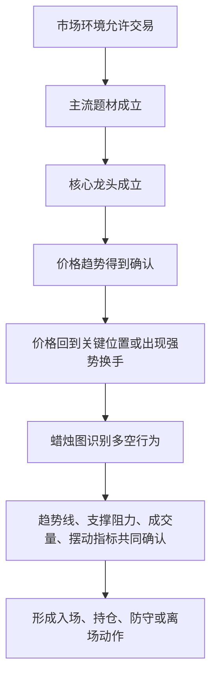

# 交易体系技术操作方法：蜡烛图重点章节提炼

> 主要思想来源：视频《从洞察环境到分歧买入》
> 技术方法来源：《日本蜡烛图技术——古老东方投资术的现代指南》
> 本次范围：第四、第五、第六、第七、第八、第九、第十、第十一、第十四、第十五章
> 文档日期：2026-07-24
> 文档性质：知识提炼与策略设计底稿；用于继续补充、量化和回测，不构成投资建议。

## 配套数据化规范

本文件负责解释书中的技术思想、形态作用和交易体系位置。具体的计算公式、严格与宽松形态、确认状态、失效条件、摆动高低点、相对强弱指标背离、随机指标背离、动力指标背离及防止未来数据泄漏的方法，见：

[《交易体系技术形态与摆动背离：数据化规范 v0.1》](交易体系技术形态与摆动背离_数据化规范_v0.1.md)

## 一、两类知识在交易体系中的位置

视频中的五步框架是整个交易体系的主干：

> 洞察市场环境 → 寻找主流题材 → 选择核心龙头 → 等待趋势确认 → 在强势分歧中买入

本书指定章节提供的是技术操作层，负责回答：

- 当前价格行为处于上涨、下跌还是横盘状态；
- 趋势是否得到价格、成交量和动能的确认；
- 分歧发生在支撑位还是无支撑的下跌途中；
- 某根蜡烛线是普通波动，还是具有操作意义的反转、持续或失败信号；
- 信号在什么条件下完成、什么条件下失效；
- 应该继续持仓、降低仓位、退出，还是等待下一次确认。

两者不能颠倒。蜡烛图不能独立决定题材是否主流，也不能证明一家公司是产业龙头。正确顺序是：



因此，本书技术应作为“趋势确认—分歧识别—交易执行—风险退出”的工具箱，而不是替代视频主框架的新策略。

## 二、十章内容的整体结构

| 章节 | 核心任务 | 在交易体系中的作用 |
|---|---|---|
| 第四章 反转形态 | 锤子线、上吊线、吞没、乌云盖顶、刺透 | 识别关键位置的多空反击 |
| 第五章 星线 | 启明星、黄昏星、十字星、流星、倒锤子线 | 识别趋势衰竭和三阶段反转 |
| 第六章 其他反转形态 | 孕线、镊子、捉腰带线、三只乌鸦等 | 补充转折、停顿和结构确认 |
| 第七章 持续形态 | 窗口、三法、白色三兵、分手线 | 判断趋势是否仍有延续能力 |
| 第八章 神奇的十字线 | 十字线及其变体 | 识别多空平衡、犹豫和顶部风险 |
| 第九章 蜡烛图技术汇总 | 综合案例与使用弹性 | 建立“形态是线索，不是机械答案”的原则 |
| 第十章 信号汇聚 | 多个技术证据共同出现 | 提升信号可信度，避免单一形态决策 |
| 第十一章 蜡烛图与趋势线 | 支撑、阻力、突破、极性转换 | 确定信号发生的位置与失效边界 |
| 第十四章 蜡烛图与摆动指数 | 相对强弱、随机、动力指标 | 判断超买超卖、背离和趋势动能 |
| 第十五章 蜡烛图与交易量、持仓量 | 成交量、能量潮、持仓量 | 验证上涨或下跌背后的参与强度 |

最重要的阅读结论是：

> 单根蜡烛线只描述一段时间内的多空结果。只有把此前趋势、所处位置、后续确认、成交量和失效条件结合起来，才可能形成交易信号。

## 三、贯穿全部章节的基本原则

### 1. 反转不一定等于立即反向

书中的“反转形态”首先表示原有趋势正在发生变化。变化可能表现为：

1. 上涨转为下跌；
2. 下跌转为上涨；
3. 趋势转为横盘整理；
4. 短暂停顿后恢复原趋势。

所以，顶部反转信号首先用于保护多头利润，底部反转信号首先用于警告空头风险。不能看到一个形态就自动反手。

### 2. 原有趋势是形态成立的前提

- 锤子线必须出现在一段下降之后；
- 上吊线必须出现在一段上升之后；
- 启明星必须发生在下降趋势或明显回落之后；
- 黄昏星必须发生在上升趋势或明显冲高之后；
- 同一根外形相似的蜡烛线，位置不同，含义可能完全不同。

如果没有明确的先前趋势，就不能只按形状命名并交易。

### 3. 主要趋势决定操作方向

- 上升大趋势中的看空形态，通常先解释为减仓、保护利润或等待，而不是立即做空；
- 下降大趋势中的看多形态，通常先解释为平空、停止追空或观察，而不是立即重仓买入；
- 新开仓方向应尽量与更高级别趋势一致；
- 逆趋势交易需要更强确认、更小仓位和更近的失效边界。

这与视频思想一致：先有环境、题材和龙头，再使用蜡烛图选择操作位置。

### 4. 确认会牺牲一部分价格，但降低误判

等待下一根蜡烛线、关键价位突破或成交量确认，通常意味着买得更高或卖得更低。但这种代价换来的是：

- 形态已经完成；
- 市场确实向预期方向运行；
- 失效位置更加明确；
- 减少仅凭盘中形态提前下注的错误。

视频同样强调“不追求最低点”，因此本体系更适合采用确认后参与，而不是预测式抄底。

### 5. 形态是指导原则，不是精确几何图案

实际市场不会总是形成教科书式图形。需要保持一定弹性，但弹性不能变成随意解释：

- 可以允许小幅价格误差；
- 不能删除形态最核心的多空关系；
- 放宽一个几何条件时，应增加位置、成交量或后续走势的确认；
- 所有容差都必须在回测前版本化，不能看完结果后临时调整。

### 6. 失效条件必须与信号同时定义

一个完整信号至少包括：

1. 前置趋势；
2. 形态条件；
3. 所处位置；
4. 确认条件；
5. 入场条件；
6. 失效价格；
7. 最大允许风险；
8. 退出或减仓条件。

只记录“出现了锤子线”不是交易规则。

## 四、第四章：反转形态

### 1. 锤子线与上吊线

两者外形相同：

- 实体较小，位于当根蜡烛线价格区间上部；
- 下影线通常至少是实体的两倍；
- 上影线很短或没有；
- 实体颜色不是最主要条件。

含义取决于位置：

- 下降后出现，称为锤子线，表示价格一度大幅下探，但收盘前被买方明显拉回；
- 上升后出现，称为上吊线，表示盘中曾出现强烈抛压，虽然价格收回，但上涨结构开始暴露风险。

操作区别：

- 锤子线本身具有看多含义，但如果此前跌势陡峭，或当日刚跌破重要支撑，应等待下一根阳线、向上跳空或收盘走强确认；
- 上吊线需要更严格的看空确认，例如次日低开，或下一根阴线收盘低于上吊线实体或收盘价；
- 形态低点或高点可作为候选失效边界，最终止损还要结合波动和仓位。

对“分歧买入”的价值：

> 核心龙头在明确上升趋势中回撤到支撑位，形成长下影、小实体并重新收回关键位置，才可能是“抛压被承接”的技术证据。没有趋势、支撑和收回动作的长下影，不能单独认定为强势分歧。

### 2. 看涨吞没与看跌吞没

成立条件：

- 市场此前存在明确趋势；
- 第二根实体颜色与第一根相反；
- 第二根实体完全包住第一根实体；
- 影线不要求被完全包住。

看涨吞没发生在下降后，表示买方用一个更大的上涨实体覆盖前一日跌势。看跌吞没发生在上升后，表示卖方用更大的下跌实体覆盖前一日涨势。

增强条件：

- 第一根实体很小，第二根实体明显扩大；
- 形态发生在长期或陡峭趋势之后；
- 第二根蜡烛线成交量明显放大；
- 第二根实体同时吞没前面多根实体；
- 形态与支撑、阻力、趋势线或前高前低重合。

失效观察：

- 看涨吞没后又出现长阴线并跌破形态低点，信号失效；
- 看跌吞没后又出现长阳线并突破形态高点，信号失效。

### 3. 乌云盖顶

典型结构：

1. 上升趋势中先出现一根较强阳线；
2. 下一根蜡烛线开盘高于前一根高点，表现为继续强势；
3. 但随后下跌，收盘深入前一根阳线实体内部；
4. 收盘越深入，顶部警告越强。

前一根阳线实体中点是重要参考。第二根阴线如果没有进入中点以下，通常需要更多看空证据，不能轻率认定为完整的乌云盖顶。

增强条件包括：

- 在长期上涨后出现；
- 高开后触及重要阻力但失败；
- 阴线成交量明显放大；
- 后续继续走弱并跌破形态低点或附近支撑。

### 4. 刺透形态

刺透形态是乌云盖顶的看多对应：

1. 下降趋势中先出现一根较强阴线；
2. 下一根蜡烛线开盘低于前一根低点；
3. 随后明显上涨；
4. 收盘必须超过前一根阴线实体的中点。

与乌云盖顶不同，刺透形态对“超过中点”的要求更严格。若只进入前一根阴线实体但未超过中点，只能视为反弹或待确认结构，不能自动按底部反转处理。

### 5. 本章进入体系后的规则

- 锤子线、看涨吞没、刺透形态：优先用于上升趋势中的回撤结束确认；
- 上吊线、看跌吞没、乌云盖顶：优先用于持仓保护、减仓和“一致转弱”识别；
- 所有形态必须绑定此前趋势和关键价位；
- 形态完成前不提前命名，完成后仍需检查后续失效。

## 五、第五章：星线

### 1. 星线的共同结构

星线通常是一个较小实体，与前一根较大实体之间形成价格分离。实体颜色并非决定条件。若小实体变成十字线，警告意义通常更强。

星线表达的是：

> 原趋势先以大实体快速推进，随后价格仍可能延续，但实体突然缩小，说明原来占优势的一方失去推进能力。

### 2. 启明星

典型三根结构：

1. 下降中的长阴线；
2. 向下分离的小实体，显示卖方推进能力衰减；
3. 强阳线明显进入第一根阴线实体。

第三根阳线进入第一根阴线越深，反转含义越强。第二根与第三根之间是否存在缺口并非最关键，尤其在缺口较少的股票市场中，应重点观察第三根阳线是否真正夺回价格区间。

### 3. 黄昏星

典型三根结构：

1. 上升中的长阳线；
2. 向上分离的小实体，显示上涨开始犹豫；
3. 阴线明显进入第一根阳线实体。

第三根阴线的回落深度是关键。下列情况更偏空：

- 星线与前后实体都形成明显分离；
- 第三根阴线深入第一根阳线；
- 第一根阳线成交量较轻，第三根阴线成交量更重；
- 形态发生在前高、阻力或长期上涨之后。

### 4. 十字启明星与十字黄昏星

当中间星线的开盘价与收盘价几乎相同，就形成十字星版本。它代表趋势推进后的强烈犹豫，通常比普通小实体星线更重要。

但十字星不是独立买卖命令，必须由第三根蜡烛线确认。两侧影线也都存在明显缺口的“弃婴形态”非常少见，不应成为系统的主要依赖。

### 5. 流星线

流星线的特征：

- 小实体位于当日价格区间下部；
- 上影线很长；
- 发生在一段上涨后；
- 表示盘中上涨被卖方全部或大部分压回。

理想形态与前一根蜡烛线之间存在价格分离，但在股票市场中不应把缺口设为绝对条件。若流星线同时触及前高、趋势阻力或出现放量回落，意义更强。

### 6. 倒锤子线

倒锤子线与流星线外形相同，但发生在下降后。其长上影表示买方曾尝试推动价格上涨，但尚未完全控制市场，因此必须等待下一根蜡烛线看多确认，例如：

- 次日向上开盘；
- 阳线收盘明显高于倒锤子线实体；
- 重新站上附近阻力或短期下降趋势线。

### 7. 本章进入体系后的规则

- 启明星适合识别回撤后的重新转强；
- 黄昏星适合识别趋势高位的动能转弱；
- 流星线和倒锤子线必须结合位置与后续确认；
- 三根结构必须等待第三根完成，不能在第二根星线出现时预判完整反转。

## 六、第六章：其他反转形态

### 1. 孕线与十字孕线

孕线由两根蜡烛线组成：

- 第一根实体较长；
- 第二根实体较小，并位于第一根实体内部；
- 颜色不是决定条件，影线也不是核心条件。

孕线通常弱于吞没形态。它主要说明趋势突然“刹车”，后续可能横盘，也可能反转。第二根为十字线时称为十字孕线，特别是在上涨高位，警告意义更强。

体系用法：

- 普通孕线只标记为“趋势停顿”；
- 十字孕线可提高警戒级别；
- 必须等待突破母线高点或低点后再判断方向；
- 不将孕线直接设为重仓反转信号。

### 2. 镊子顶与镊子底

两根或多根蜡烛线在相近位置形成相同或近似高点，构成镊子顶；形成相同或近似低点，构成镊子底。

它们在以下情况更有意义：

- 与吞没、锤子线、上吊线或星线同时出现；
- 位于重要支撑或阻力；
- 出现在周线、月线等较高级别；
- 第二次测试伴随成交量衰减或明显拒绝。

### 3. 捉腰带线

- 看涨捉腰带线：下降后出现长阳线，开盘接近当日最低价；
- 看跌捉腰带线：上升后出现长阴线，开盘接近当日最高价。

实体越长、此前趋势越充分，信号越值得关注。其作用更接近强势反击，需要后续价格保持在形态有利一侧。

### 4. 三只乌鸦

典型结构：

- 上涨或高位区域出现连续三根阴线；
- 收盘逐步降低，且接近各自低点；
- 后一根通常在前一根实体内开盘；
- 表示卖方连续三次占据主动。

这是较强的顶部或趋势转弱信号。若发生在短期已经大幅下跌之后，则不能脱离位置机械解释。

### 5. 反击线

反击线由方向相反的两根较长蜡烛线组成，第二根经历明显跳空或延续后，最终收在与第一根相近的价格。

其反转程度通常弱于刺透形态或乌云盖顶，适合作为辅助确认，不宜单独承担主要入场信号。

### 6. 向上跳空两只乌鸦与铺垫形态

向上跳空两只乌鸦是较少见的顶部形态：上涨背景中先出现强阳线，随后连续出现两根位于其上方的阴线，第二根阴线包住第一只“乌鸦”的实体，但价格仍未完全填补最初的向上窗口。这表示市场连续高开却无法保持强势。

铺垫形态与它外形相近，但属于看多持续形态。小实体整理没有明显破坏前一根长阳线，最后由强阳线向上突破完成确认。两者不能在中间阶段提前区分，必须等待最后一根蜡烛线完成。

由于向上跳空两只乌鸦非常少见，系统初版只记录。铺垫形态可以与上升三法共同归入“强推动—受控整理—向上恢复”的持续结构。

### 7. 三山、三川、圆形和塔形结构

这些结构描述多次测试和较长时间的价格转变：

- 三山顶部：三次冲击相近高位，第三次需要看空蜡烛图确认；
- 三川底部：三次测试相近低位，价格向上突破结构高点后才确认；
- 圆形顶部或底部：实体逐步缩小并形成弧形，随后由向下或向上的窗口确认；
- 塔形顶部或底部：一侧长实体推进，中间停顿，随后出现相反方向长实体。

这些形态更接近“价格结构”，需要较长观察窗口，不适合作为单日快速信号。

### 8. 低优先级的罕见形态

向上跳空两只乌鸦、弃婴形态等结构较少出现。系统初版不宜为罕见形态投入过多复杂度，应先验证高频、逻辑清晰、容易定义失效条件的形态。

## 七、第七章：持续形态

这一章对视频中的“趋势确认”和“上涨中分歧买入”尤其重要，因为有效分歧的前提不是猜反转，而是原有上升趋势仍具延续能力。

### 1. 窗口

蜡烛图中的窗口相当于价格缺口，判断以影线之间是否存在空白区间为准。

核心原则：

- 向上窗口通常构成支撑；
- 向下窗口通常构成阻力；
- 交易方向优先顺着窗口方向；
- 市场常会回测窗口，因此窗口可作为回撤观察区；
- 价格填补窗口不等于趋势自动失效，填补后继续向相反方向推进才更危险；
- 突破整理区或重要高点的窗口，比普通波动中的小缺口更有意义。

在视频体系中，向上窗口可以用于判断：

- 趋势是否真正启动；
- 分歧回撤是否守住启动成本区；
- 原阻力突破后是否完成“阻力转支撑”。

### 2. 连续新高、新低与三空警告

若价格连续八至十个单位不断创出新高或新低，且没有有意义的修正，应警惕趋势过度延伸。

同一趋势连续出现三个窗口，并在第三个窗口后出现反转蜡烛线，可能表示趋势接近衰竭。这里的窗口数量不能脱离趋势长度和市场环境机械使用。

### 3. 高价位与低价位跳空突破

典型结构：

1. 一根强势长实体；
2. 随后若干根小实体横向整理；
3. 价格沿原趋势方向形成窗口突破。

这说明市场用短暂整理消化筹码后继续推进，属于持续确认。系统可将其解释为：

- 强趋势后的缩量或窄幅整理；
- 没有明显破坏原长实体；
- 最终以窗口或强收盘完成再启动。

### 4. 上升三法与下降三法

上升三法的典型结构：

1. 一根长阳线确立上涨推动；
2. 中间出现二至五根小实体回撤或横盘，大体保持在第一根高低范围内；
3. 最后一根强阳线向上恢复，并收在第一根阳线收盘价之上。

下降三法相反。

关键操作原则：

- 中间的小阴线并不自动等于趋势转弱；
- 只有最后一根趋势方向蜡烛线完成，持续形态才确认；
- 外侧推动蜡烛线成交量较大、中间整理成交量较小，结构更健康；
- 未出现最后确认前，不应提前假定三法已经完成。

上升三法与视频中的“分歧买入”高度接近：上涨后发生获利回吐，但回撤受控，随后买方再次推动价格创新高。

### 5. 白色三兵、前方受阻和停顿

白色三兵：

- 低位或整理后出现连续三根阳线；
- 收盘逐步抬高并接近各自高点；
- 后一根通常在前一根实体内部或附近开盘；
- 表示买方连续取得控制。

若三根阳线逐渐缩短、上影线逐渐增长，形成“前方受阻”；若最后一根变成很小的实体，形成“停顿”。这两种变化更适合：

- 保护已有多头利润；
- 暂停追高；
- 等待整理或下一次确认。

它们并不天然构成做空信号。

### 6. 分手线

分手线由颜色相反的两根蜡烛线组成，开盘价相同或接近，第二根蜡烛线重新沿原趋势方向强势运行。

它反映的是市场曾尝试向反方向发展，但原趋势方重新掌握控制。体系中可作为趋势恢复的辅助证据。

## 八、第八章：十字线

### 1. 十字线的本质

十字线的开盘价与收盘价相同或非常接近，表示经过一个周期的多空争夺，双方最终回到近似起点。

是否把“近似相同”认定为十字线，需要结合：

- 当根蜡烛线的总波动范围；
- 标的正常最小价格变动；
- 近期实体的典型大小；
- 十字线在该标的上是否罕见。

如果近期已经大量出现小实体或十字线，新出现的十字线信息增量较低。

### 2. 十字线在顶部比底部更有效

上涨需要持续买盘推动；长期上涨后出现十字线，说明买方无法继续扩大优势，容易形成顶部警告。

下跌则可能在缺乏买盘时继续惯性下行。因此，下降后的十字线通常需要更强的上涨确认，不能仅凭犹豫状态抄底。

### 3. 重要出现位置

十字线在以下情形中更值得重视：

- 长期上涨后；
- 一根长阳线之后；
- 超买区域；
- 前高、阻力或趋势线上；
- 与黄昏星、孕线或镊子顶组合；
- 之后出现看空确认。

### 4. 长脚十字线、黄包车夫线和墓碑十字线

- 长脚十字线：上下影线较长，表示盘中多空大幅争夺但最终平衡；
- 黄包车夫线：开收盘接近当日区间中部，是长脚十字线的一类；
- 墓碑十字线：开收盘接近最低价，带长上影；在上涨高位尤其偏空，因为盘中上涨被完全压回。

墓碑十字线与流星线逻辑相似，但开收盘更接近，因此顶部拒绝含义通常更明显。

### 5. 三星形态

连续三根十字线或近似十字线构成非常少见的三星形态，可能对应重大转折。由于出现频率低，系统初版只记录，不应作为主要策略模块。

### 6. 时间周期限制

过短周期容易产生大量十字线，降低其辨识度。书中提示三十分钟以下周期应谨慎使用。后续量化时必须分别统计日线、小时线和更短周期的有效性，不能共享同一阈值。

## 九、第九章：蜡烛图技术汇总

这一章最重要的不是新增形态，而是使用方法。

### 1. 蜡烛图分析具有判断性

同一形态可以采用不同操作方式：

- 激进型：形态完成后立即行动；
- 中性型：先平掉与信号相反的仓位，再等待确认；
- 保守型：等待下一根蜡烛线或关键价位突破后行动。

本体系以“确认后参与”为默认，但应保留策略风格参数，供回测比较。

### 2. 多个信号可能重叠

一组蜡烛线可能同时构成：

- 上吊线与孕线；
- 锤子线与看涨吞没；
- 流星线与镊子顶；
- 十字线与黄昏星；
- 吞没形态与关键支撑反弹。

重叠不应被简单理解为“标签越多越强”。如果多个名称来自同一根蜡烛线的同一个特征，它们并不是独立证据。

### 3. 未确认和被否定的信号不能保留原评级

如果看空形态后价格迅速向上突破形态高点，或看多形态后价格跌破形态低点，系统必须把信号标记为失效，而不是继续展示为有效历史结论。

建议状态至少分为：

1. 候选；
2. 已完成；
3. 已确认；
4. 已触发；
5. 已失效；
6. 已结束。

## 十、第十章：蜡烛图信号的汇聚

### 1. 汇聚的含义

当多个相互独立的技术证据集中在同一价格区域时，转折或持续的可信度提高。例如：

- 锤子线 + 历史支撑 + 缩量回撤 + 次日放量上涨；
- 看涨吞没 + 趋势线支撑 + 随机指标金叉；
- 流星线 + 前高阻力 + 相对强弱指标顶背离；
- 假突破 + 看跌吞没 + 放量跌回整理区。

汇聚的价值不在于堆叠形态名称，而在于从不同角度验证同一市场事实：

- 蜡烛线：本周期多空结果；
- 位置：为什么在这里发生；
- 趋势：应该顺势还是逆势；
- 成交量：多少资金参与；
- 动能：价格推进是否加速或衰减；
- 后续走势：市场是否真正接受该方向。

### 2. 独立证据与重复证据

以下通常是独立证据：

- 形态；
- 支撑或阻力；
- 趋势方向；
- 成交量结构；
- 动能背离；
- 后续突破或确认。

以下可能只是重复标签：

- 同一根长下影同时被称为锤子线和镊子底的一部分；
- 同一根长上影同时被称为流星线和墓碑式拒绝；
- 同一组两根蜡烛线同时被多个相近形态名称描述。

未来评分系统应按“证据来源类别”计分，不能按检测到的形态标签数量直接累加。

### 3. 关键位置可能推翻孤立形态的表面含义

上涨后出现十字线可能偏空，但如果它发生在刚突破并已转为支撑的旧阻力之上，且后续始终守住支撑，那么短期上涨趋势并未被破坏。

因此，判断优先级应为：

> 大级别趋势与环境 → 关键位置 → 价格结构 → 蜡烛形态 → 成交量和摆动指标 → 后续确认

## 十一、第十一章：蜡烛图与趋势线

### 1. 趋势线的基本定义

- 上升支撑线：至少连接两个逐步抬高的反应低点；
- 下降阻力线：至少连接两个逐步降低的反应高点。

趋势线的可靠性随以下因素增强：

- 被测试的次数增加；
- 每次测试附近出现明显成交；
- 存在时间更长；
- 多次测试后仍未被有效收盘突破。

### 2. 蜡烛形态与趋势线结合

单独的锤子线只说明当日下探被拉回；发生在上升趋势线或历史支撑上的锤子线，才进一步说明市场在已知防守区重新承接。

同理：

- 阻力线上的流星线或看跌吞没，比随机位置的相同形态更重要；
- 支撑线上的刺透形态或启明星，更适合识别回撤结束；
- 趋势线被有效跌破后，原有看多形态需要降级或失效。

### 3. 突破不能只看盘中影线

价格短暂越过趋势线后又收回，可能是假突破。有效突破更强调：

- 收盘位于趋势线之外；
- 后续继续保持在突破方向；
- 回测时原趋势线发生支撑或阻力转换；
- 成交量或价格推进提供确认。

### 4. 假突破交易逻辑

向上假突破：

1. 价格突破旧阻力；
2. 随后重新跌回原区间；
3. 看空蜡烛图进一步确认；
4. 可将假突破高点作为候选失效边界；
5. 区间另一侧可作为候选目标区域。

向下假突破相反：

1. 价格跌破旧支撑；
2. 随后重新站回原区间；
3. 看多蜡烛图确认承接；
4. 假突破低点成为候选失效边界。

这类结构非常适合定义清晰的风险收益关系，但必须在实际成交规则中考虑跳空和滑点。

### 5. 支撑阻力的极性转换

旧阻力被有效突破后，常转化为支撑；旧支撑被跌破后，常转化为阻力。

背后的行为逻辑是：

- 错过突破的人等待回测参与；
- 原来被套的人回到成本附近选择退出；
- 已持仓的人在原突破区继续防守。

在视频体系中，核心龙头突破新高后回测旧高点，若旧阻力成功转为支撑，并出现承接型蜡烛图，可作为“趋势已经确认后的分歧买点”候选。

### 6. 风险管理

书中反复强调在入场前确定止损。可选依据包括：

- 形态低点或高点；
- 趋势线外侧；
- 假突破极值；
- 关键支撑或阻力失守；
- 后续确认失败。

技术形态的主要优势之一，就是提供相对明确的“判断错误位置”。但仓位仍应由组合风险预算决定，不能仅按止损距离反推无限仓位。

## 十二、第十四章：蜡烛图与摆动指数

摆动指数主要用于三件事：

1. 识别超买和超卖；
2. 发现价格与动能之间的背离；
3. 判断趋势推进是否增强或衰减。

摆动指标在横盘区间通常更有效。在强趋势刚启动时，指标可能长时间停留在超买或超卖区域，因此不能仅凭“超买”做空强势龙头，也不能仅凭“超卖”买入下降趋势。

### 1. 相对强弱指标

相对强弱指标通常写作 RSI（Relative Strength Index，相对强弱指数），计算思想为：

```text
RSI = 100 - 100 / (1 + RS)
RS = 一定周期内平均上涨幅度 / 平均下跌幅度
```

常用周期包括九个或十四个单位。传统参考区间是：

- 高于 70，进入超买观察区；
- 高于 80，属于更极端超买；
- 低于 30，进入超卖观察区；
- 低于 20，属于更极端超卖。

这些数值不是所有标的和市场都适用的固定交易阈值，必须用目标市场数据重新检验。

背离：

- 顶背离：价格创出新高，相对强弱指标未创新高，表示上涨动能减弱；
- 底背离：价格创出新低，相对强弱指标未创新低，表示下跌动能减弱；
- 背离发生在超买或超卖区时通常更值得关注；
- 背离仍需要蜡烛图或价格突破确认。

### 2. 随机摆动指标

随机摆动指标通常写作 Stochastic Oscillator（随机摆动指标），核心思想是观察收盘价在最近一段最高价和最低价之间的位置。

```text
%K = (当前收盘价 - N周期最低价) / (N周期最高价 - N周期最低价) × 100
```

常见周期包括九、十四或二十一个单位。慢速随机指标通常对快速数值进行平滑，再形成 K 线和 D 线。

书中给出的较强看多组合是：

1. D 值位于较低区域，例如不高于 25；
2. 价格与指标形成底背离；
3. K 线向上穿越 D 线；
4. 同时出现看多蜡烛图。

看空组合相反。具体阈值、平滑方式和穿越确认必须在回测中固定。

### 3. 动力指标

动力指标可简化为：

```text
动力值 = 当前收盘价 - N周期前收盘价
```

用途包括：

- 价格继续上涨但动力值走平或下降，说明上涨速度正在衰减；
- 动力值越过零轴，可作为方向变化的辅助确认；
- 极端值与标的自身历史有关，不能使用统一绝对阈值。

### 4. 摆动指标在本体系中的地位

- 不能取代环境、题材、龙头和价格趋势；
- 强趋势中超买不是自动卖出信号；
- 超卖不是下降趋势中的自动买入信号；
- 背离用于发出“动能不再确认价格”的警告；
- 蜡烛形态和关键价位用于给出更接近操作的确认。

## 十三、第十五章：蜡烛图与交易量、持仓量

### 1. 成交量确认趋势

健康趋势通常表现为：

- 上涨推进时成交量增加，回撤时成交量减小；
- 下跌推进时成交量增加，反弹时成交量减小。

如果价格继续沿趋势运行，而成交量持续下降，说明趋势得到的参与支持正在减弱，但这仍是警告，不等于立即反转。

### 2. 二次测试中的成交量

- 再次测试阻力时成交量比第一次小，说明买方推动能力减弱，顶部风险提高；
- 再次测试支撑时成交量比第一次小，说明卖方压力减弱，底部成功概率提高；
- 若第二次测试同时出现拒绝型蜡烛线，信号更强。

这一点适合用于镊子顶底、双重顶底和假突破判断。

### 3. 成交量与蜡烛图的汇聚

例子：

- 看涨吞没的第二根阳线放量，说明反击得到更多资金参与；
- 看跌吞没的第二根阴线放量，说明抛售更有力度；
- 上升三法中，整理阶段缩量、恢复上涨时放量，持续结构更健康；
- 分歧日虽然放量，但价格仍收在相对高位，说明大量卖盘被承接；
- 放量长阴跌破关键支撑，不能继续解释为普通分歧。

### 4. 能量潮

能量潮通常写作 OBV（On-Balance Volume，能量潮指标）：

- 当日上涨，将当日成交量加到累计值；
- 当日下跌，从累计值中减去当日成交量。

使用原则：

- 价格上涨时，能量潮通常也应上涨；
- 价格横盘而能量潮上升，可能表示资金积累；
- 价格横盘而能量潮下降，可能表示资金派发；
- 价格与能量潮背离，再与蜡烛形态结合，警告意义增强。

### 5. 即时成交次数与实际成交量

书中提到盘中市场可用即时成交次数作为实际成交量的替代观察。对于中国 A 股，本体系能直接获得成交量、成交额和换手率，应优先使用实际数据，不必把成交次数作为主要代理变量。

### 6. 持仓量的适用边界

持仓量主要适用于期货和衍生品：

- 趋势发展且持仓量增加，通常表示新资金进入并确认趋势；
- 趋势发展但持仓量下降，可能主要由旧仓平仓推动，趋势相对脆弱；
- 新高附近异常持仓可能引发止损连锁。

中国 A 股现货股票没有与期货相同的持仓量口径，因此本模块不应直接套用于普通股票。后续若扩展到股指期货、商品期货或期权，再单独启用。

## 十四、形态的系统优先级

### 第一优先级：适合首轮量化与回测

这些形态逻辑清楚、出现频率相对较高、失效位置容易定义：

- 锤子线与上吊线；
- 看涨与看跌吞没；
- 刺透形态与乌云盖顶；
- 启明星与黄昏星；
- 流星线与倒锤子线；
- 关键位置的十字线；
- 向上与向下窗口；
- 上升三法与下降三法；
- 白色三兵、前方受阻和停顿；
- 趋势线支撑阻力；
- 突破、假突破和极性转换；
- 成交量确认与相对强弱指标背离。

### 第二优先级：适合作为辅助证据

- 孕线与十字孕线；
- 镊子顶与镊子底；
- 捉腰带线；
- 三只乌鸦；
- 反击线；
- 分手线；
- 能量潮背离；
- 随机摆动指标交叉。

### 第三优先级：先记录，暂不作为主要决策

- 弃婴形态；
- 向上跳空两只乌鸦；
- 三星形态；
- 三山与三川；
- 圆形顶部与底部；
- 塔形顶部与底部；
- 股票策略中的期货持仓量信号。

优先级不是评价形态“好坏”，而是控制系统初版的复杂度，优先验证可解释、可重复和可回测的规则。

## 十五、与视频五步框架的具体融合

| 视频步骤 | 蜡烛图技术的作用 | 不能由蜡烛图决定的内容 |
|---|---|---|
| 洞察环境 | 判断指数趋势、支撑阻力、窗口、成交量和动能 | 宏观环境、市场容量和总体风险预算 |
| 寻找主流题材 | 观察板块趋势是否持续、突破是否被资金确认 | 产业政策、供需逻辑和题材真实性 |
| 选择核心龙头 | 比较价格强度、回撤韧性、突破和成交量结构 | 公司业务相关度、业绩质量和产业地位 |
| 等待趋势确认 | 窗口、白色三兵、上升三法、突破回测、量价和动能确认 | 龙头的产业逻辑是否成立 |
| 强势分歧买入 | 支撑区锤子线、看涨吞没、刺透、启明星、上升三法、缩量回撤后放量恢复 | 是否值得交易、总体仓位和组合风险 |

### 1. “趋势确认”的技术定义候选

至少从下列证据中选择若干项，而不是只看一根阳线：

- 价格突破前高、整理区或下降趋势线；
- 突破后收盘保持在关键位置之上；
- 原阻力回测后转为支撑；
- 形成向上窗口且回测不被有效跌破；
- 连续推动蜡烛线表现强势；
- 推进阶段成交量高于整理或回撤阶段；
- 相对强弱和动力指标没有明显背离；
- 标的走势强于所属板块和市场指数。

### 2. “强势分歧”的技术定义候选

有效分歧应同时满足四层条件：

1. 前提层
   - 市场环境没有进入明显风险状态；
   - 标的属于已确认主流题材和核心龙头；
   - 此前已经形成明确上升趋势。

2. 分歧层
   - 启动后出现获利回吐、盘中下探或短期整理；
   - 成交量显示筹码交换，或回撤过程呈现卖压衰减；
   - 不是无量阴跌，也不是放量破位。

3. 承接层
   - 收盘位置相对强；
   - 守住向上窗口、突破位、趋势线或前一推动结构；
   - 出现锤子线、看涨吞没、刺透、启明星或上升三法等承接证据；
   - 后续一根蜡烛线重新走强。

4. 失效层
   - 跌破分歧结构低点；
   - 有效跌破关键支撑并不能迅速收回；
   - 放量长阴破坏趋势；
   - 题材、龙头或市场环境上游状态失效。

### 3. “卖在一致”的技术候选

视频尚未完整定义卖出。本书可提供以下候选警告：

- 长期上涨后出现黄昏星、看跌吞没或乌云盖顶；
- 高位出现上吊线、流星线、墓碑十字线并得到后续确认；
- 白色三兵之后实体缩短、上影增长或出现停顿；
- 价格创新高，但相对强弱、动力或能量潮不创新高；
- 再次冲击阻力时成交量下降；
- 向上假突破后重新跌回原区间；
- 原支撑被放量跌破并转化为阻力；
- 第三个向上窗口之后出现反转蜡烛图；
- 放量但价格无法继续上涨，随后收盘转弱。

这些信号应分级处理：

- 一级警告：停止加仓；
- 二级警告：部分止盈或收紧保护线；
- 三级确认：跌破结构后退出；
- 上游失效：环境、题材或龙头身份改变时独立降仓。

具体等级需要你进一步补充。

## 十六、四类可执行交易模板

### 模板 A：突破回测后的分歧买入

条件链：

1. 主流题材与核心龙头已确认；
2. 价格放量突破前高或整理区；
3. 回测旧阻力，旧阻力转为支撑；
4. 回测不出现放量破位；
5. 支撑区出现锤子线、看涨吞没、刺透或启明星；
6. 下一根蜡烛线确认上涨；
7. 形态低点或支撑失守时失效。

### 模板 B：上升三法式分歧买入

条件链：

1. 先出现明确上涨推动；
2. 二至五个周期进行受控回撤或窄幅整理；
3. 中间波动大体不破坏第一根推动区间；
4. 整理成交量低于推动阶段；
5. 最后出现强阳线并突破第一根收盘或结构高点；
6. 最后一根确认后才触发，不在整理中预判。

### 模板 C：向上窗口回测买入

条件链：

1. 向上窗口发生在突破或趋势推进中；
2. 回撤进入窗口附近；
3. 窗口被部分或全部填补，但卖方未继续扩大优势；
4. 出现长下影、看涨吞没或假跌破收回；
5. 后续重新站稳窗口上沿或关键价格；
6. 持续跌破窗口和附近支撑时失效。

### 模板 D：顶部一致转弱与退出

条件链：

1. 标的经历明显上涨和市场共识扩散；
2. 出现加速、连续窗口或高位放量；
3. 价格继续创新高但动能或能量潮不确认；
4. 高位出现黄昏星、看跌吞没、流星线或墓碑十字线；
5. 下一根蜡烛线跌破形态或短期支撑；
6. 停止加仓、分批减仓或退出；
7. 若形态高点被强势突破，则原看空判断失效。

## 十七、可编码的统一数据结构草案

每个技术信号建议保存以下字段，避免日后只保留一个总分：

| 字段 | 含义 |
|---|---|
| 标的与周期 | 股票代码、日线或盘中周期 |
| 识别时间 | 形态完成的时间，不使用未来数据 |
| 信号名称 | 锤子线、吞没、启明星等 |
| 信号方向 | 看多、看空、持续、警告、中性 |
| 前置趋势 | 上升、下降、横盘及其强度 |
| 价格位置 | 支撑、阻力、窗口、趋势线、前高前低 |
| 形态质量 | 几何条件完成程度 |
| 独立确认 | 成交量、动能、背离、后续突破 |
| 上游状态 | 市场环境、题材状态、龙头身份 |
| 信号状态 | 候选、完成、确认、触发、失效、结束 |
| 触发价格 | 真正允许操作的价格条件 |
| 失效价格 | 判断错误的边界 |
| 风险距离 | 触发价到失效价的距离 |
| 参数版本 | 当次回测使用的规则版本 |
| 解释文本 | 为什么出现信号，便于人工复核 |

蜡烛线最基础的可计算量：

```text
实体长度 = |收盘价 - 开盘价|
总波动 = 最高价 - 最低价
上影线 = 最高价 - max(开盘价, 收盘价)
下影线 = min(开盘价, 收盘价) - 最低价
收盘位置 = (收盘价 - 最低价) / (最高价 - 最低价)
```

书中没有给出的精确比例，例如“上影线很短”“实体很小”“价格近似相等”，必须设置为待校准参数，不能伪装成原书结论。

## 十八、首轮量化时必须避免的问题

1. 用未来几天的数据判断当天形态，然后把信号时间错误地记在当天；
2. 只识别几何形状，不检查此前趋势；
3. 同一根蜡烛线贴多个标签后重复加分；
4. 以盘中突破代替收盘确认；
5. 把强趋势中的超买直接当成做空信号；
6. 把下降趋势中的超卖直接当成买入信号；
7. 忽略除权、复权、涨跌停和停牌对形态的影响；
8. 忽略不可成交、滑点和交易成本；
9. 在所有股票和所有周期上使用同一固定阈值；
10. 只优化收益，不观察最大回撤、胜率、盈亏比和信号频率；
11. 回测后按结果修改形态解释，却不更新参数版本；
12. 用蜡烛图技术结果反推题材和基本面一定成立。

## 十九、需要你继续补充的内容

以下内容是把知识转成完整交易体系前的关键空白。

### A. 市场与标的范围

- [待你补充] 只做中国 A 股，还是还包括港股、美股、期货？
- [待你补充] 主操作周期是日线、六十分钟、三十分钟，还是多周期组合？
- [待你补充] 是否排除创业板、科创板、北交所、特殊处理股票和上市不满一定时间的股票？

### B. 趋势定义

- [待你补充] 上升趋势使用均线、前高前低、趋势线、斜率还是组合判断？
- [待你补充] 趋势确认需要持续多少个周期？
- [待你补充] “强斜率”和“新高趋势”的精确定义是什么？

### C. 分歧定义

- [待你补充] 分歧发生在启动后第几天到第几天最有效？
- [待你补充] 放量换手的成交量、成交额和换手率范围；
- [待你补充] 怎样定义“价格仍然强势”；
- [待你补充] 回撤多深属于健康，超过多深属于结构破坏；
- [待你补充] 缩量回撤与放量分歧是否都属于买点，如何分级？

### D. 入场与确认

- [待你补充] 形态完成收盘买、次日开盘买，还是突破确认价买？
- [待你补充] 是否允许盘中触发，还是只使用收盘数据？
- [待你补充] 哪些形态可以单独触发，哪些只能作为辅助确认？
- [待你补充] 至少需要几个独立证据才能操作？

### E. 止损、止盈和仓位

- [待你补充] 止损按形态极值、关键支撑、固定比例还是波动率？
- [待你补充] 单笔最大风险、单票仓位和单一题材集中度；
- [待你补充] “卖在一致”的分批退出规则；
- [待你补充] 是否使用移动保护线、时间止损和盈利回撤止盈？
- [待你补充] 信号正确但短期不涨时，最多持有多少周期？

### F. 形态参数

- [待你补充] 十字线的开收盘容差；
- [待你补充] 小实体和长实体的相对定义；
- [待你补充] 锤子线“很短上影线”的最大比例；
- [待你补充] 支撑阻力“同一价格区域”的容差；
- [待你补充] 放量和缩量相对哪个历史窗口计算；
- [待你补充] 相对强弱和随机指标的周期与阈值。

## 二十、当前提炼结论

这十章真正应该进入交易体系的，不是一张“形态名称大全”，而是以下操作逻辑：

> 先确认上游的市场环境、主流题材和核心龙头；再确认价格已经形成趋势；等待价格回到有意义的支撑、突破位、窗口或趋势线；用蜡烛图观察抛压是否被承接；用成交量、动能和后续价格确认；只在信号完成后行动，并在入场前定义失效边界。

对于买入，最值得优先研究的是：

> 上升趋势中的受控回撤 + 关键支撑未破 + 承接型蜡烛图 + 成交量结构健康 + 后续重新走强。

对于卖出，最值得优先研究的是：

> 上涨充分或加速一致 + 动能或成交不再确认 + 高位拒绝型蜡烛图 + 关键支撑被跌破。

这份文档先固定技术语言和依赖顺序。你后续补充的经验，应优先写入“需要你继续补充的内容”，再逐项转化为有输入、有阈值、有确认、有失效、有版本的规则，最后进入代码和回测。
