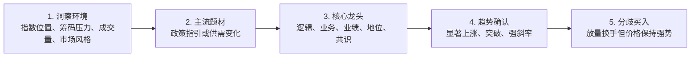

# 视频核心思想：从洞察环境到分歧买入

> 来源视频：`3c89cf0dac1a459523cd4bbd91757af1.mp4`
> 视频时长：约 11 分 36 秒
> 提取日期：2026-07-24
> 文档性质：交易知识提取稿，不代表已经形成可直接实盘的完整策略，也不构成投资建议。

## 一句话总结

这套方法强调自上而下地筛选交易机会：先判断市场环境和资金容量，再从政策指引或供需变化中寻找主流题材，选择具备真实产业逻辑、业绩和市场地位的核心龙头，等待价格走势确认趋势，最后在上涨趋势中的强势分歧换手阶段参与。

## 五步核心框架

### 1. 洞察环境

对应视频约 `00:00:52—00:02:32`。

环境判断包含三个方面：

- 指数所处位置：左侧套牢盘和右侧获利盘都会形成潜在抛压。任一侧压力过大，都可能需要通过分歧和调整释放风险。
- 市场成交量：不同成交规模能够同时支撑的题材数量不同。成交量越充沛，市场活跃度和总体赚钱效应通常越强。
- 近期市场风格：观察一段时间内赚钱效应持续集中在哪类公司、产业和形态，而不是只看单日热点。

核心含义：先判断市场是否具备承载行情的条件，再决定应该集中进攻还是等待风险释放。

### 2. 寻找主流题材

对应视频约 `00:02:32—00:05:20`。

视频将持续性较强的主流题材归纳为两类：

1. 政策指引型
   - 国家或产业政策明确未来发展方向；
   - 当下可能尚未产生充分利润，但已经出现大规模投资和建设；
   - 产业链中的设备、建设、材料或服务公司可能率先受益。

2. 供需变化型
   - 新需求快速增长，原有产能无法立即满足；
   - 供需缺口能够形成价格、订单或业绩改善预期；
   - 需求持续放大时，产业链行情可能具有更强持续性。

视频以人工智能基础设施、算力硬件、光模块、存储芯片、印制电路板及其上游材料为案例，但这些案例只用于解释方法，不应直接视为当前投资推荐。

核心含义：不要在每天轮动的零散概念之间追逐，应寻找能够解释资金持续聚集的主线逻辑。

### 3. 选择核心龙头

对应视频约 `00:05:20—00:07:14`。

视频给出的龙头特征包括：

- 产业需求增长或政策投入逻辑成立；
- 公司主营业务与题材的关系真实、直接；
- 业绩质量较好，或者存在较明确的业绩兑现预期；
- 在产业链中具有较强地位；
- 股价接近新高、正在突破新高或已经进入新高趋势；
- 市场共识较强，提到该方向时容易首先想到这家公司；
- 结论建立在业务和产业事实之上，不能只依赖情绪与故事。

核心含义：龙头不是“涨得最多的任意股票”，而是产业逻辑、公司质量、市场地位和技术走势共同指向的核心标的。

### 4. 等待趋势确认

对应视频约 `00:07:14—00:08:47`。

视频认为，仅有消息和逻辑还不够，市场必须通过价格行为“表态”：

- 出现涨停、连续大阳线或其他显著上涨；
- 走势形成较陡的上升斜率；
- 参与者和认可资金持续增加；
- 市场信息逐步扩散后，价格形成上升惯性。

较强的价格斜率被视为资金认可度更高的表现。方法上不强调在趋势出现前抢跑，而是先确认走势已经形成。

核心含义：宁可放弃最低点，也要等待逻辑转化为真实的市场共识和价格趋势。

### 5. 在强势分歧中买入

对应视频约 `00:08:47—00:10:12`。

视频中的“分歧”是指：

- 股票启动并连续上涨若干日后，部分获利资金选择卖出；
- 尚未参与或继续看好的资金选择承接；
- 成交量放大，说明筹码正在充分交换；
- 抛压出现后，价格没有大幅回落，收盘或盘中表现仍然强势。

其底层解释是多空动能对决：看空和获利了结的资金已经集中卖出，但价格仍然跌不下去，说明承接力量较强。这种“放量但不弱”的上涨途中换手，被视为比盲目追涨更合适的参与位置。

视频引用了“买在分歧，卖在一致”，但只详细说明了分歧买入，没有定义“一致卖出”的具体条件。

## 核心交易思想

### 自上而下，而不是只看个股形态

完整选择顺序是：

1. 市场是否适合交易；
2. 资金聚焦在哪个主流方向；
3. 该方向中谁是真正的核心公司；
4. 价格是否已经确认市场共识；
5. 是否出现风险收益比较合适的分歧买点。

任何单独一层都不足以构成完整信号。

### 基本面负责解释持续性，技术面负责确认资金态度

视频并未把技术上涨等同于公司质量，而是要求：

- 产业与业绩事实支撑长期逻辑；
- 价格和成交量验证市场是否认可该逻辑；
- 两者一致时，趋势的持续性更值得关注。

### 不追求买在最低点

方法接受在趋势确认后以更高价格参与，以降低逻辑没有被市场认可、股票无法真正启动的风险。

### 分歧不是普通下跌

视频描述的有效分歧至少包含两个条件：

- 前提是已经形成明确的上升趋势；
- 抛压和放量出现后，价格仍表现出较强承接。

如果趋势尚未形成，或者放量后价格明显破坏结构，就不能仅凭“下跌了”认定为分歧买点。

## 可转化为代码的变量

| 模块 | 可观测变量 | 视频尚未给出的内容 |
|---|---|---|
| 市场环境 | 指数位置、历史筹码压力、全市场成交额、上涨家数、赚钱效应集中度 | 高低风险的具体阈值 |
| 主流题材 | 政策事件、产业投资、需求增速、产能利用率、订单和价格变化、板块资金集中度 | 题材进入和退出主流状态的规则 |
| 核心龙头 | 主营业务相关度、业绩增速、产业链地位、板块排名、新高距离、市场关注度 | 各项权重和合格门槛 |
| 趋势确认 | 涨停、连续阳线、突破新高、收益率、上涨斜率、成交量 | 确认所需天数和精确参数 |
| 分歧买入 | 启动后的上涨天数、当日振幅、回撤、成交量放大、收盘位置、结构是否保持 | 买入时点、委托价格和信号失效条件 |

## 与现有交易体系的对应关系

这段视频适合作为交易体系的顶层决策链，而不应直接压缩成一个混合总分：

- “洞察环境”可对应核心策略的市场趋势与风险状态；
- “主流题材”和龙头的产业事实可由基本面板块模块提供；
- “趋势确认”和“分歧强度”可由个股技术评分模块量化；
- “核心龙头”需要在基本面结论与技术龙头结果之间建立独立融合层；
- “分歧买入”属于交易执行信号，应与板块识别和龙头选举分开保存、回测和版本管理。

这样可以保留每个结论的来源，避免用新闻叙事直接修改技术分，也避免用一次上涨反推基本面结论。

## 形成可执行策略前仍需确认

该视频提供了清晰的方法论，但还不是完整交易策略。后续必须补齐：

1. 市场环境的状态分类与量化阈值；
2. 主流题材的发现、确认、降级和退出规则；
3. 基本面“真实受益”和“业绩好”的数据口径；
4. 龙头评分、候选数量和替换机制；
5. 趋势确认的价格、成交量和持续天数参数；
6. 强势分歧与结构破坏的精确定义；
7. 买入时点、委托方式、滑点和涨跌停不可成交处理；
8. 止损、止盈、减仓、退出和“卖在一致”的规则；
9. 单票仓位、板块集中度、组合回撤和总风险预算；
10. 回测区间、样本外检验、交易成本和防止未来数据泄漏的方法。

## 提取结论

视频最有价值的部分不是具体题材案例，而是一条依赖顺序明确的决策链：

> 环境允许交易 → 题材具备持续逻辑 → 公司是事实上的核心龙头 → 市场价格确认趋势 → 上涨途中出现放量承接的强势分歧 → 考虑参与。

下一步应继续收集用户认可的知识材料，逐项补齐上述缺失规则；只有在每个概念都具备明确输入、状态、阈值、失效条件和版本后，才能进入回测与代码实现。
